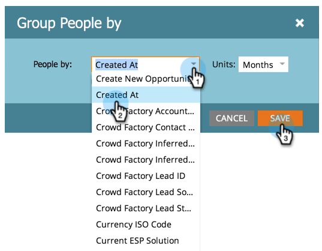

# 按照屬性將人員報告分組 {#group-person-reports-by-attribute}

您可以依任何人員或公司屬性將個人報表分組。

1. 移至&#x200B;**[!UICONTROL Marketing Activities]** （或&#x200B;**[!UICONTROL Analytics]**）區域。

   

1. 從導覽樹狀結構中選取您的人員報表，然後按一下「**[!UICONTROL Setup]**」標籤。

   

1. 連按兩下&#x200B;**[!UICONTROL Group People by]**。

   

   >[!NOTE]
   >
   >您也可以[依區段](/help/marketo/product-docs/personalization/segmentation-and-snippets/segmentation/group-person-reports-by-segment.md)將您的個人報表分組。

   在[!UICONTROL Group People by]對話方塊中，選取要用於分組的人員或公司屬性。

   

   >[!TIP]
   >
   >如果您選擇具有數值的屬性，例如&#x200B;_[!UICONTROL Created At]_&#x200B;或_[!UICONTROL Annual Revenue]_，請從右側的&#x200B;**[!UICONTROL Units]**&#x200B;下拉式清單中選取量度。

   按一下「**[!UICONTROL Report]**」標籤，檢視您相應分組的報告。

   

   >[!MORELIKETHIS]
   >
   >[新增自訂欄至人員報表](/help/marketo/product-docs/reporting/basic-reporting/editing-reports/add-custom-columns-to-a-person-report.md)
