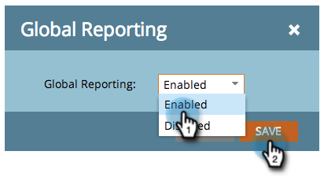

# 報告電子郵件、跨工作區的促銷活動績效{#report-email-campaign-performance-across-workspaces}

開啟「全域報表」，將您所有行銷人員的[工作區](../../../../product-docs/administration/workspaces-and-person-partitions/create-a-new-workspace.md)資料納入[電子郵件效能](../../../../product-docs/email-marketing/email-programs/email-program-data/email-performance-report.md)、[電子郵件連結效能](../../../../product-docs/email-marketing/email-programs/email-program-data/email-link-performance-report.md)和[促銷活動](../../../../product-docs/reporting/basic-reporting/report-types/campaign-activity-report.md)報表。

1. 前往&#x200B;**Analytics**（或&#x200B;**行銷活動**）區域。

   

1. 選擇您的報表。

   

1. 按一下「**Setup**」標籤，然後按兩下「全域報表」**。**

   

1. 選擇&#x200B;**啟用**。

   

1. 就這樣！ 按一下&#x200B;**報表**&#x200B;標籤，查看您所有工作區的資料。

   

   >[!MORELIKETHIS]
   >
   >
   >    
   >    
   >    * [篩選電子郵件報表中的資產](filter-assets-in-an-email-report.md)

   >[!NOTE]
   >
   >**深入探討**
   >
   >
   >瞭解[基本報表](https://docs.marketo.com/display/docs/basic+reporting)中的所有報表。

