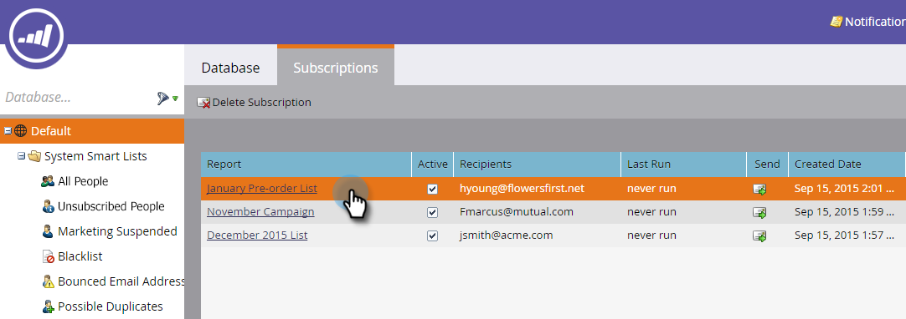
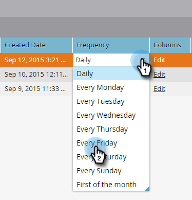
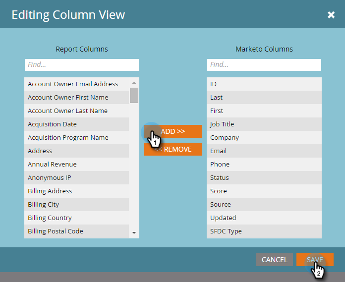

# 編輯智慧清單訂閱{#edit-a-smart-list-subscription}

您可以直接在「訂閱」索引標籤中編輯這些欄，而此標籤會顯示在「行銷活動」或「資料庫」中：

* 收件者
* 頻率
* 欄
* 結束傳送
* 格式

1. 選擇&#x200B;**Database**（本例中我們使用它，但「行銷活動」的運作完全相同）。

   

1. 選擇您要編輯的訂閱。

   

1. 按一下「收件者」欄，它就會開啟，讓您輸入更多電子郵件地址（以逗號分隔）。

   

1. 按一下&#x200B;**Frequency**&#x200B;列以選擇或更改設定。

   

1. 開啟&#x200B;**欄**&#x200B;欄，然後使用選取器來新增或移除報表中的欄。 「報表欄」包含所有可用欄，而「行銷欄」只會顯示您選取要顯示在報表中的欄。 按一下&#x200B;**保存**。

   

   >[!NOTE]
   >
   >「行銷欄」下方的欄是報表欄，而非「訂閱」報表標籤中使用的欄。

1. 按一下&#x200B;**結束日期**&#x200B;列以編輯結束日期。 選擇&#x200B;**Never**&#x200B;或&#x200B;**Date**。 對於日期，請輸入日期或從日曆中選擇日期。 按一下&#x200B;**批准**。

   

1. 拼圖的最後一塊是格式。 按一下&#x200B;**Format**&#x200B;列並選擇所需列。 CSV為預設值。

   
