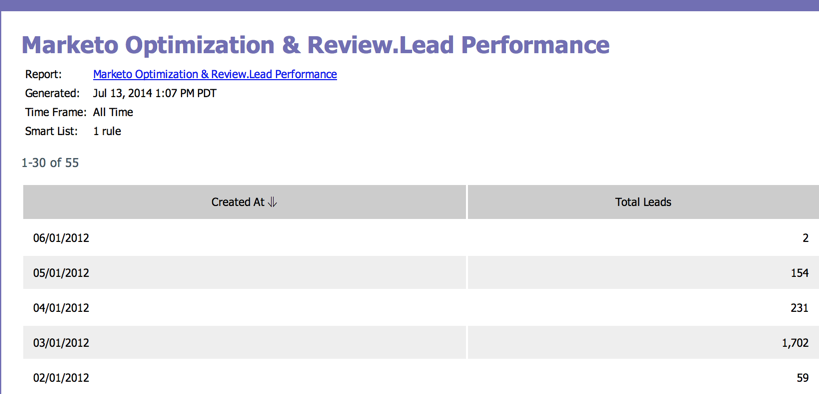

# 訂閱基本報表 {#subscribe-to-a-basic-report}

若要接收基本報告的自動更新或共用基本報告，您可以訂閱現有報告的任何電子郵件地址。

>[!NOTE]
>
>如需收入週期總管報表訂閱，請參閱 [訂閱Revenue Explorer報表](/help/marketo/product-docs/reporting/revenue-cycle-analytics/revenue-explorer/subscribe-to-a-revenue-explorer-report.md).

1. 前往 **行銷活動** 區域。

   

1. 從導覽樹狀結構中選取報表，然後按一下 **訂閱** 標籤。

   

   >[!NOTE]
   >
   >您也可以從以下網址訂閱報表： **分析** 標籤。

1. 按一下 **新報表訂閱**.

   

1. 輸入電子郵件地址，並設定報表電子郵件的頻率。

   

   >[!NOTE]
   >
   >任何人都可以透過電子郵件取消訂閱該報告。

   完成了！ 檢查您的收件匣！

   

   >[!MORELIKETHIS]
   >
   >瞭解如何 [管理您的所有報表訂閱](/help/marketo/product-docs/reporting/basic-reporting/report-subscriptions/manage-report-subscriptions.md) 在一個位置。
