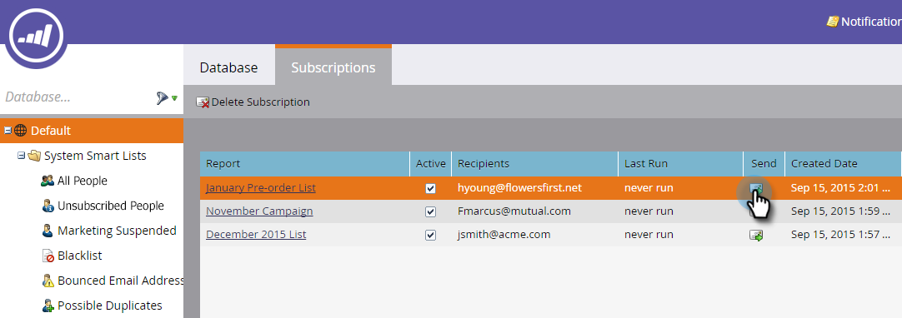
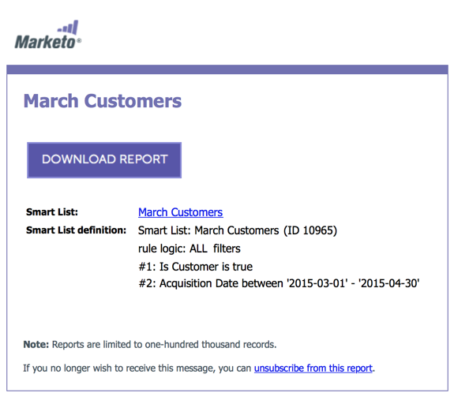

# 訂閱智慧清單 {#subscribe-to-a-smart-list}

訂閱智慧清單是追蹤人員的好方法，報表會直接傳送到您的收件匣。

您可以在兩個不同的位置建立智慧清單訂閱：

* 行銷活動
* 資料庫

訂閱會使用執行訂閱時的完整人員清單。

訂閱會在您的智慧清單所在的位置（行銷活動或資料庫）上線。

您可以從相同的智慧清單建立多個訂閱。

訂閱是工作區專屬的。 例如，此訂閱清單與本文其餘部分所示的工作區不同：

>[!NOTE]
>
>各工作區及每個Marketo例項的上限為100個訂閱，每個訂閱的上限為100,000人。 如果智慧清單包含超過100,000個名稱，Marketo會對前100,000個名稱執行訂閱。

## 建立智慧清單訂閱 {#create-a-smart-list-subscription}

1. 前往 **資料庫** 或 **行銷活動**.

   

1. 選取您要為其建立訂閱的智慧清單。 按一下 **清單動作** 並選取 **新增智慧清單訂閱**.

   

1. 為您的訂閱提供 **名稱**，然後選取或輸入 **收件者**.

   

1. 按一下 **頻率** 清單並選取頻率。

   

1. 設定 **結束傳遞** 日期。 您可以選取 **從不** 或行事曆日期。

   

1. 按一下 **格式** 並從清單中選擇。

   

1. 按一下 **建立**。

   

1. 您的新智慧清單訂閱會顯示在「訂閱」索引標籤的清單頂端。 按一下 **傳送** 如果您想立即傳送，不要等到排程的電子郵件傳送。

   

1. 如果沒有任何人訂閱智慧清單訂閱，建議您清除「作用中」核取方塊，以停用智慧清單訂閱。

   

   這很容易，不是嗎？

## 電子郵件訊息 {#email-message}

收件者會收到內含下載報表選項的電子郵件，以及直接連至Marketo執行個體中清單的連結。 下載連結將在四天後到期。

>[!NOTE]
>
>如果 [安全訂閱管理](/help/marketo/product-docs/reporting/basic-reporting/report-subscriptions/secure-the-subscription-admin-setting.md) 設定已設為 **是**，只有可存取Marketo例項的使用者才能下載報表。

如果報表中有0位人員，收件者仍會收到電子郵件。 不過，電子郵件僅會說明沒有人員可報告。

>[!NOTE]
>
>當您修改訂閱所依據的智慧清單篩選器時，也會更新報表。

電子郵件也會提供有關用於建立清單的篩選器的其他資訊。

## 刪除訂閱 {#delete-a-subscription}

若要刪除訂閱，請在「訂閱」索引標籤中選取訂閱，然後按一下「刪除訂閱」。

>[!MORELIKETHIS]
>
>* [編輯智慧清單訂閱](/help/marketo/product-docs/reporting/basic-reporting/report-subscriptions/edit-a-smart-list-subscription.md)
>* [保護訂閱管理設定](/help/marketo/product-docs/reporting/basic-reporting/report-subscriptions/secure-the-subscription-admin-setting.md)
