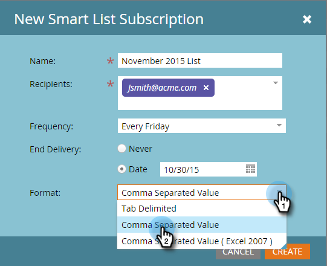

# 訂閱智慧清單{#subscribe-to-a-smart-list}

訂閱智慧型清單是追蹤人員的絕佳方式，報表會直接傳送至您的收件匣。

您可以在兩個不同位置建立智慧型清單訂閱：

* 行銷活動
* 資料庫

訂閱會在訂閱執行時使用人員的完整清單。

在「行銷活動」或「資料庫」中，訂閱會存在於智慧清單所在的位置。

您可以從同一個智慧型清單建立多個訂閱。

訂閱是特定於工作區的。 例如，此訂閱清單位於與本文其餘部分所顯示之訂閱清單不同的工作區：

>[!NOTE]
>
>您的訂閱上限為100份，每個訂閱、跨工作區、每個行銷實例最多100,000人。 如果智慧型清單包含超過100,000個名稱，Marketo將會執行前100,000個訂閱。

## 建立智慧清單預訂{#create-a-smart-list-subscription}

1. 前往&#x200B;**Database**&#x200B;或&#x200B;**行銷活動**。

   

1. 選擇要為其建立訂閱的智慧清單。 按一下&#x200B;**列出操作**&#x200B;並選擇&#x200B;**新建智慧清單訂閱**。

   

1. 為您的訂閱提供&#x200B;**名稱**，然後選擇或輸入&#x200B;**收件者**&#x200B;的電子郵件地址。

   

1. 按一下&#x200B;**Frequency**&#x200B;清單並選擇頻率。

   

1. 設定&#x200B;**結束傳送**&#x200B;日期。 您可以選擇&#x200B;**Never**&#x200B;或日曆日期。

   

1. 按一下&#x200B;**格式**&#x200B;並從清單中選擇。

   

1. 按一下&#x200B;**建立**。

   

1. 您的新智慧型清單訂閱會出現在「訂閱」索引標籤的清單頂端。 如果您想立即傳送，請按一下「傳送&#x200B;****」，等待排程的電子郵件傳送。

   

1. 建議您清除「活動」核取方塊，以停用未訂閱智慧型清單訂閱（如果未訂閱）。

   

   那很簡單，不是嗎？

## 電子郵件{#email-message}

收件者將會收到電子郵件，內含下載報表的選項，以及直接連結至Marketo例項中清單的選項。 下載連結將在4天後過期。

>[!NOTE]
>
>如果[安全訂閱管理員](/help/marketo/product-docs/reporting/basic-reporting/report-subscriptions/secure-the-subscription-admin-setting.md)設定設為&#x200B;**是**，則只有可存取Marketo例項的人員才能下載報表。

如果報表中有0個人，收件者仍會收到電子郵件。 不過，電子郵件只是指出沒有人可以報告。

>[!NOTE]
>
>當您修改已依據訂閱的智慧型清單篩選時，也會更新報表。

此電子郵件也提供建立清單所用篩選器的其他資訊。

## 刪除訂閱{#delete-a-subscription}

若要刪除訂閱，請在訂閱標籤中選取該訂閱，然後按一下刪除訂閱。

>[!MORELIKETHIS]
>
>* [編輯智慧清單訂閱](/help/marketo/product-docs/reporting/basic-reporting/report-subscriptions/edit-a-smart-list-subscription.md)
>* [保護訂閱管理員設定](/help/marketo/product-docs/reporting/basic-reporting/report-subscriptions/secure-the-subscription-admin-setting.md)

