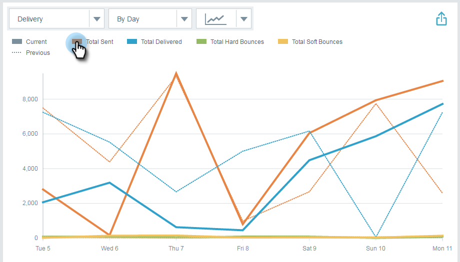

# 電子郵件分析概述{#email-insights-analytics-overview}

在Analytics中，探索電子郵件傳送與參與的匯總資料。 使用左側的圖表來探索資料、右側的見解，以獲得更具引導性的體驗。

[篩](/help/marketo/product-docs/reporting/email-insights/filtering-in-email-insights.md) 選功能可協助您深入檢視特定量度。

關鍵地標(KPI)圖格可讓您快速檢視較受歡迎的量度。

將滑鼠指標暫留在KPI圖格上，以取得詳細資訊……

...或是展開您的瀏覽器視窗（在較大的螢幕上），即可檢視詳細資訊，而不需暫留。

>[!TIP]
>
>這些顏色有意義！ 綠色表示好的變化，紅色表示壞的變化，灰色表示沒有變化。 這是以您在篩選時選擇的比較時段為基礎。

圖表會顯示您的篩選條件。 若要隱藏其中一個濾鏡，只要按一下其顏色列……

...而量度會從圖表中消失。 再按一下顏色列，讓它重新出現。

如果您要建立想再次使用的圖表，請將它設為[quick chart](/help/marketo/product-docs/reporting/email-insights/email-insights-quick-charts.md)。

在頁面右側，引導式量度可協助您發現相關的驅動程式。 按一下任何度量，即可在頁面左側的圖表中查看。

>[!NOTE]
>
>看到右上方的「刷新」了嗎？ 當您看到它時，需要手動按一下它以重新整理「前瞻分析」模組。 我們只會在您變更會使目前值失效的篩選器時顯示它。

您也可以指定您所看到的內容（從左至右）:所有、觀眾、內容和平台。

>[!MORELIKETHIS]
>
>[電子郵件見解傳送概述](/help/marketo/product-docs/reporting/email-insights/email-insights-sends-overview.md)
