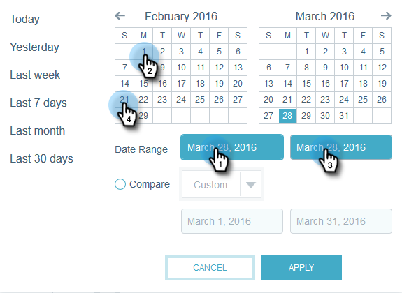

# 電子郵件深入分析快速圖表 {#email-insights-quick-charts}

快速圖表是您自訂和儲存的縮圖，可讓您快速檢視您最常使用的圖表。

## 建立新的快速圖表 {#create-a-new-quick-chart}

在此範例中，我們將選擇加利福尼亞州和佛羅里達州的2016年2月前三週的開放率。

1. 按一下Analytics畫面右側的日期篩選器。

   

1. 選擇您想要的日期範圍。

   

1. 選取日期範圍時，按一下 **套用**.

   

1. 圖表會在您的日期套用後變更。

   

1. 按一下第一個下拉式清單。 按一下以選取您的條件（如果尚未選取）並取消選取任何不想要的條件。

   

1. 在圖表的右側，按一下匯出圖示並選取 **另存為快速圖表**.

   

1. 為快速圖表命名，然後按一下 **儲存**.

   

   >[!NOTE]
   >
   >您最多可以有20個快速圖表。 它們可以刪除和取代。

1. 您的新快速圖表將會與其他圖表一起顯示。

   

   就是這樣！

   >[!TIP]
   >
   >若要移動任何快速圖表，只要按一下並將它拖曳到需要的位置即可。

## 刪除快速圖表 {#delete-a-quick-chart}

想要刪除您的其中一個快速圖表？ 操作很簡單！

1. 按一下 **快速圖表** 圖示。

   

1. 暫留在所需的圖表上，但請勿按一下圖表。 游標暫留時，將會出現X。 按一下 **X**.

   

1. 按一下 **確定**.

   

   您的快速圖表現已刪除。 告訴您這很容易。
