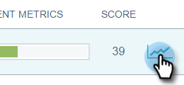

# 電子郵件深入分析傳送概覽 {#email-insights-sends-overview}

在「傳送」頁面上，檢查最近電子郵件通訊的特性。

使用 [篩選](/help/marketo/product-docs/reporting/email-insights/filtering-in-email-insights.md) 以指定您要檢視的電子郵件。

在頁面的右側，有幾個關於您傳送的電子郵件的資訊。

**型別** 表示使用的資產型別。
**收件者** 數字是已傳送電子郵件的人數。
**傳遞量度** 可讓您快速檢視已傳送、擱置或退回的電子郵件數量。\
**參與量度** 可讓您快速檢視有多少收件者已開啟、點選及取消訂閱電子郵件。
**分數** 是您電子郵件的 [參與分數](/help/marketo/product-docs/email-marketing/drip-nurturing/reports-and-notifications/understanding-the-engagement-score.md).

依預設，您的電子郵件會依最近使用的量度排序，但您可以依任何可用的量度排序。

>[!NOTE]
>
>電子郵件會依方案或行銷活動名稱（上）和電子郵件資產名稱（下）列出。

如果您想要在Analytics中檢視電子郵件的統計資料，請將游標暫留在「分數」旁，然後按一下圖表圖示。

很酷的東西！

>[!MORELIKETHIS]
>
>[電子郵件分析Analytics概觀](/help/marketo/product-docs/reporting/email-insights/email-insights-analytics-overview.md)
