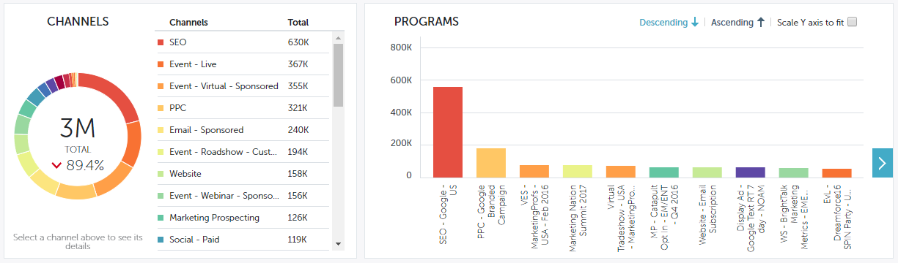

# 效能分析的篩選{#filtering-in-performance-insights}

輕鬆篩選資料以查詢特定資訊。

按一下+以開始新增篩選。

>[!NOTE]
>
>目前，「自訂屬性」僅適用於啟用「收入週期分析」的客戶。

按一下類別可顯示多個子類別。

選擇子類別並搜尋／選取值。

圖表會更新以反映選取的篩選。

您可以依照相同的步驟新增其他篩選器。

您可以隨時按一下篩選旁的X來移除篩選。 按一下最右邊的X，一次移除所有篩選。

## 可用篩選器{#available-filters}

<table> 
 <tbody> 
  <tr> 
   <td colspan="1"><strong>ABM帳戶清單</strong></td> 
   <td colspan="1">如果您使用Marketo ABM，所有帳戶清單都會同步至MPI，並透過「ABM帳戶清單」篩選器顯示。 您可以選取帳戶清單，以篩選結果給這些帳戶。<a href="https://docs.marketo.com/display/public/DOCS/Account-Based+Web+Marketing+with+ABM" rel="nofollow">進一步瞭解ABM帳戶清單。</a></td> 
  </tr> 
  <tr> 
   <td colspan="1"><strong>ABM命名帳戶</strong></td> 
   <td colspan="1">如果您使用Marketo ABM，則所有已命名帳戶都會同步至MPI，並透過「ABM已命名帳戶」篩選器顯示。 您可以選取一個已命名的帳戶，以篩選這些帳戶的結果。<a href="https://docs.marketo.com/x/eaCt" rel="nofollow">進一步瞭解ABM命名帳戶。</a></td> 
  </tr> 
  <tr> 
   <td colspan="1"><strong>自訂屬性</strong></td> 
   <td colspan="1">
這些由您決定。 您為業務機會分析啟用的<a href="/help/marketo/product-docs/reporting/revenue-cycle-analytics/revenue-tools/enabling-custom-field-sync-for-revenue-cycle-analytics.md" rel="nofollow">所有欄位都可以在「效能分析」中篩選。</a>
</td> 
  </tr> 
  <tr> 
   <td colspan="1">
<strong>投資期</strong>
</td> 
   <td colspan="1">
計畫成本時間範圍。
</td> 
  </tr> 
  <tr> 
   <td colspan="1">
<strong>業務機會類型</strong>
</td> 
   <td colspan="1">
業務機會類型，如在Salesforce(CRM)設定中的Opportunity對象上設定。
</td> 
  </tr> 
  <tr> 
   <td>
<strong>方案標籤</strong>
</td> 
   <td>
標籤用於描述程式。 您可以視需要製作任意數量的影像，每個影像都具有獨特的值。 <a href="/help/marketo/product-docs/administration/tags/create-a-new-program-tag-and-tag-values.md" rel="nofollow">在這裡瞭解如何使用程式標籤。</a>
</td> 
  </tr> 
  <tr> 
   <td><strong>工作區</strong></td> 
   <td>
工作區是Marketo中持有行銷資產的個別區域，例如：程式、登陸頁面、電子郵件等。 <a href="/help/marketo/product-docs/administration/workspaces-and-person-partitions/understanding-workspaces-and-person-partitions.md" rel="nofollow">在這裡進一步瞭解工作區。</a>
</td> 
  </tr> 
 </tbody> 
</table>

>[!NOTE]
>
>在「參與」控制面板中，只有程式標籤和工作區篩選器可用。
