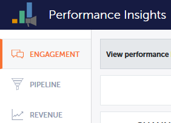

# [!UICONTROL Performance Insights]個儀表板 {#performance-insights-dashboards}

進一步瞭解MPI中可用的儀表板。

## [!UICONTROL Engagement] {#engagement}

[!UICONTROL Engagement]儀表板可協助您測量Nurture和新名稱擷取計畫的成效。

測量受眾參與

選擇&#x200B;**[!UICONTROL Successes]**&#x200B;量度以測量您的Nurture方案中的對象參與度。 在Marketo中，成功是衡量有意義的互動。

方案的目的是建立與人員或潛在客戶的有意義的互動。 當個人達到達到達到該目標的狀態時會標籤成功。 可能是參加網路研討會、按一下電子郵件中的連結，或填寫網路表單。 成功與否因方案管道而異。

>[!NOTE]
>
>網路研討會計畫中有多種狀態，例如：已邀請、已註冊和已參加。 「已邀請」或「已註冊」互動沒有意義，因為使用者不會實際觀看網路研討會。 在此情況下，出席被視為成功。

測量新名稱贏取

選擇&#x200B;**[!UICONTROL New Names]**&#x200B;量度以測量新名稱擷取程式的有效性。

>[!NOTE]
>
>您的所有計畫都必須設定為設定贏取計畫和潛在客戶的贏取日期，才能讓此儀表板為您提供最佳結果。

## [!UICONTROL Pipeline] {#pipeline}

[!UICONTROL Pipeline]儀表板會依首次接觸與多點接觸量度顯示管道效能。

<table>
 <tbody>
  <tr>
   <td>
<strong>新商機</strong>
</td>
   <td>
計畫因影響新商機的建立而收到的信用部份。 如果涉及多個銷售機會，則可能為小數。
</td>
  </tr>
  <tr>
   <td>
<strong>管道已建立</strong>
</td>
   <td>
程式因影響機會建立而收到的信用部份（貨幣價值）。 如果涉及多個銷售機會，則可能是總數的小部分。
</td>
  </tr>
  <tr>
   <td>
<strong>管道已開啟</strong>
</td>
   <td>
程式收到的信用部份（以貨幣價值表示），用來影響仍然未結的商機的建立。 如果涉及多個銷售機會，則可能是總數的小部分。
</td>
  </tr>
  <tr>
   <td>
<strong>預期收入</strong>
</td>
   <td>
程式因影響機會建立而收到的信用部份（貨幣價值）。 預期收入是機會機率乘以機會值。 如果涉及多個銷售機會，則可能為小數。
</td>
  </tr>
  <tr>
   <td>
<strong>每個已建立機會的成本</strong>
</td>
   <td>
影響新商機的方案成本部分除以建立的新商機總數。
</td>
  </tr>
  <tr>
   <td>
<strong>管道建立成本比率</strong>
</td>
   <td>
計畫收到的影響新機會建立的信用部分，除以影響機會建立的計畫成本部分。
</td>
  </tr>
 </tbody>
</table>

## [!UICONTROL Revenue] {#revenue}

[!UICONTROL Revenue]儀表板會依首次接觸與多點接觸量度顯示管道效能。

<table>
 <tbody>
  <tr>
   <td>
<strong>已贏得的機會</strong>
</td>
   <td>
計畫因影響成功的機會而收到的點數部份。
</td>
  </tr>
  <tr>
   <td>
<strong>贏得的收入</strong>
</td>
   <td>
因影響成功的機會而收到的信用部份（貨幣價值）。
</td>
  </tr>
  <tr>
   <td>
<strong>每個成功的機會的成本</strong>
</td>
   <td>
影響新商機的方案成本部分除以建立的新商機總數。
</td>
  </tr>
  <tr>
   <td>
<strong>收入對成本比率</strong>
</td>
   <td>
因影響成功的機會而收到的信用部份（以貨幣價值表示），除以影響新機會的方案成本部份。
</td>
  </tr>
 </tbody>
</table>
