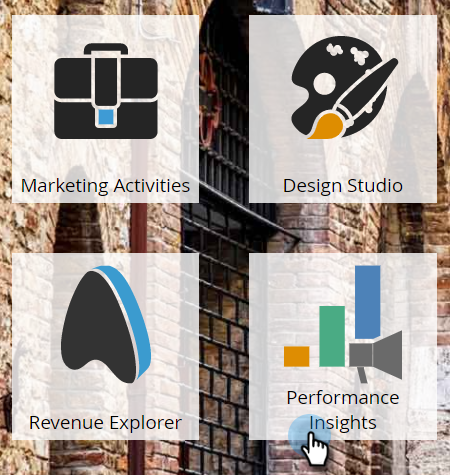
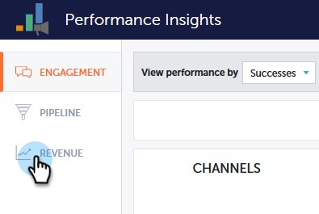

# Performance Insights概述 {#performance-insights-overview}

MarketoPerformance Insights可幫助您優化渠道組合以實現最大效率，並發現長期趨勢以發現一致的獲勝策略。

Performance Insights從（最多）前24個月載入資料。 這包括當前的年初至今資料以及上一年的資料。例如，在2019年1月31日，MPI將從當月開始載入資料，從2018年開始，每個月載入資料。 2019年12月31日，MPI將在2019年和2018年每月載入資料。

要訪問Performance Insights，請按一下分析主螢幕上的表徵圖。

## 貢獻 {#contribution}

評估營銷 [收入貢獻](/help/marketo/product-docs/reporting/performance-insights/performance-insights-contribution-overview.md) 作為客戶獲取、影響、轉換甚至客戶群增長的函式。

預設情況下，顯示的資料反映了Oracle Engagement的效能。 只需按一下其中一個，即可通過Pipeline或Revenue切換到效能。

## 趨勢 {#trend}

發現 [長期趨勢](/help/marketo/product-docs/reporting/performance-insights/performance-insights-trend-overview.md) 找出一致的獲勝策略。

## 設定 {#settings}

在「收入和管道」控制面板中，按一下 [設定](/help/marketo/product-docs/reporting/performance-insights/performance-insights-settings.md) 表徵圖以設定其他參數。

## 導出資料 {#export-data}

可以在PowerPoint或Excel中導出資料和圖表。 您還可以將它們另存為 [快速圖表](/help/marketo/product-docs/reporting/performance-insights/performance-insights-quick-charts.md)。

>[!NOTE]
>
>將資料導出到Excel以查看所有通道（不僅是前十個通道）的可用資料。 PPT導出將為WYSIWYG（輸出將模擬螢幕上的內容）。
