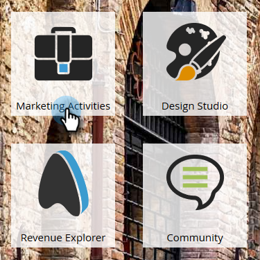

# 設定績效分析 {#setting-up-performance-insights}

請按照以下步驟設定MPI。

## 機會設定 {#opportunity-setup}

1. 按一下 **管理**.

   

1. 按一下 **收入週期分析**.

   

   >[!NOTE]
   >
   >如果您沒有RCA，則需要選取 **程式分析** （針對步驟2）。

1. 在歸因下，按一下 **編輯**.

   

1. 歸因設定隨即顯示。

   

   如果Attribution是明確的，請確保已填入Opportunity Contact Role（通過Opportunity Role終結點或通過CRM整合）。

   如果隱含「歸因」，請確保銷售機會/聯繫人上的公司欄位與銷售機會的帳戶名稱相同。

   >[!NOTE]
   >
   >確保所有機會都填入了相應欄位：
   >
   >* 機會金額
   >* 已關閉
   >* 是元
   >* 建立日期（在您的情況下，可能未設定此日期）
   >* 結束日期（在您的情況下，可能無法設定）
   >* 機會類型

## 程式設定 {#program-setup}

更新方案費用至少12個月。 您可以手動或使用程式API執行此操作。 在此範例中，我們會手動執行。

1. 按一下 **行銷活動**.

   

1. 尋找並選取您的方案。

   

1. 按一下 **設定** 標籤。

   

1. 拖曳 **期間成本** 到畫布上。

   

1. 將方案月份設定為至少12個月前，然後按一下 **確定**.

   

1. 設定期間成本，然後按一下 **儲存**.

   

接下來，檢閱分析行為，指出是否應將特定管道納入分析中。 設定Analytics行為（一般、包含、操作）。

1. 按一下 **管理**.

   

1. 按一下 **標籤**.

   

1. 按一下 **+** 以展開「管道」清單。

   

1. 連按兩下所需的頻道。

   

1. 按一下 **Analytics行為** 下拉式清單中，並選取所需的行為。

   

1. 設定成功標準。

   

1. 按一下 **儲存**.

   

## 將程式與人員關聯 {#tie-the-program-to-the-person}

1. 請確定已為資料庫中的每個人設定贏取方案和贏取日期，以便首次接觸歸因運作。
1. 確保您的計畫為您的人員設定成功狀態。

>[!NOTE]
>
>所做的變更並非即時。 變更生效前需要隔夜時間。
