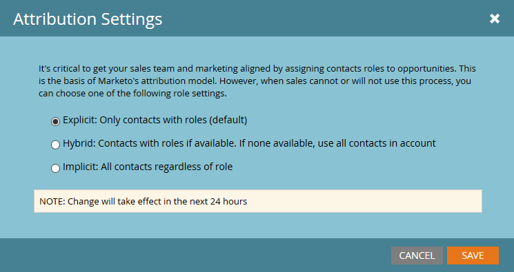

# 設定效能分析{#setting-up-performance-insights}

按照以下步驟設定MPI。

## 業務機會設定{#opportunity-setup}

1. 按一下&#x200B;**管理**。

   

1. 按一下「收入週期分析」。****

   

   >[!NOTE]
   >
   >如果沒有RCA，則需要為步驟2選擇&#x200B;**Program Analysis**。

1. 在「歸因」下，按一下「編輯」。****

   

1. 顯示「歸因設定」。

   

   如果Attribution是明確的，請確保已填充Opportunity Contact角色（通過Opportunity Role端點或通過CRM整合）。

   如果隱含Attribution，請確保銷售機會／聯繫人上的公司欄位與業務機會的Account Name相同。

   >[!NOTE]
   >
   >確保所有機會都已填入適當的欄位：
   >
   >* 機會金額
   >* 已關閉
   >* Is Won
   >* 建立日期（在您的情況下可能無法設定）
   >* 關閉日期（在您的情況下可能無法設定）
   >* 業務機會類型

## 程式設定{#program-setup}

更新方案成本至少12個月。 您可以手動或使用程式API來執行此動作。 在此範例中，我們手動執行。

1. 按一下「行銷活動」**。**

   

1. 尋找並選取您的方案。

   

1. 按一下&#x200B;**Setup**&#x200B;頁籤。

   

1. 將&#x200B;**期間成本**&#x200B;拖曳至畫布上。

   

1. 將方案月份設為至少12個月前，然後按一下「確定」。****

   

1. 設定期間成本並按一下&#x200B;**保存**。

   

接著，檢閱分析行為，以指出分析中是否應包含特定渠道。 設定Analytics行為（一般、包含、操作）。

1. 按一下&#x200B;**管理**。

   

1. 按一下「**標籤**」。

   

1. 按一下&#x200B;**+**&#x200B;展開「Channel（通道）」清單。

   

1. 按兩下所要的頻道。

   

1. 按一下「**Analytics行為**」下拉式清單，並選取所要的行為。

   

1. 設定成功條件。

   

1. 按一下&#x200B;**保存**。

   

## 將程式與{#tie-the-program-to-the-person}人員關聯

1. 請確定已為資料庫中的每個人設定「贏取計畫」和「贏取日期」，以便「首次接觸歸因」運作。
1. 確保您的計畫為您的人員設定成功狀態。

>[!NOTE]
>
>所做的變更並非即時。 變更生效前需要隔夜時間。
