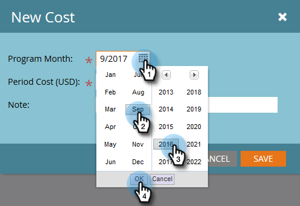

# 正在設定[!UICONTROL Performance Insights] {#setting-up-performance-insights}

請依照下列步驟設定MPI。

## 機會設定 {#opportunity-setup}

1. 按一下「**[!UICONTROL Admin]**」。

   

1. 按一下「**[!UICONTROL Revenue Cycle Analytics]**」。

   

   >[!NOTE]
   >
   >如果您沒有RCA，則必須為步驟2選取&#x200B;**[!UICONTROL Program Analysis]**。

1. 在歸因底下，按一下&#x200B;**[!UICONTROL Edit]**。

   

1. 歸因設定隨即顯示。

   

   如果歸因明確，請確保已填入機會聯絡人角色（透過機會角色端點或透過CRM整合）。

   如果「歸因」是隱含的，請確定潛在客戶/聯絡人上的「公司」欄位與商機的「帳戶名稱」相同。

   >[!NOTE]
   >
   >請確認所有商機皆已填入適當的欄位：
   >
   >* [!UICONTROL Opportunity Amount]
   >* [!UICONTROL Is Closed]
   >* [!UICONTROL Is Won]
   >* [!UICONTROL Creation Date] （您的案例中可能未設定此專案）
   >* [!UICONTROL Closed Date] （您的案例中可能未設定此專案）
   >* [!UICONTROL Opportunity Type]

## 計畫設定 {#program-setup}

更新計畫成本至少12個月。 您可以手動或使用程式API執行此操作。 在此範例中，我們會手動進行。

1. 按一下「**[!UICONTROL Marketing Activities]**」。

   

1. 尋找並選取您的程式。

   

1. 按一下「**[!UICONTROL Setup]**」標籤。

   

1. 將&#x200B;**[!UICONTROL Period Cost]**&#x200B;拖曳到畫布上。

   

1. 設定至少12個月前的計畫月份，然後按一下&#x200B;**[!UICONTROL Ok]**。

   

1. 設定期間成本並按一下&#x200B;**[!UICONTROL Save]**。

   

接下來，檢閱分析行為，指出分析中是否應包含特定管道。 設定Analytics行為（正常、包含、運作）。

1. 按一下「**[!UICONTROL Admin]**」。

   

1. 按一下「**[!UICONTROL Tags]**」。

   

1. 按一下&#x200B;**+**&#x200B;以展開頻道清單。

   

1. 按兩下所需的通道。

   

1. 按一下&#x200B;**[!UICONTROL Analytics Behavior]**&#x200B;下拉式清單，然後選取想要的行為。

   

1. 設定成功標準。

   

1. 按一下「**[!UICONTROL Save]**」。

   

## 將方案連結至人員 {#tie-the-program-to-the-person}

1. 請確定已為資料庫中的每個人設定贏取方案和贏取日期，以便首次接觸歸因能夠運作。
1. 確保您的方案為使用者設定成功狀態。

>[!NOTE]
>
>所做的變更不會立即生效。 在變更生效之前，必須過夜。
