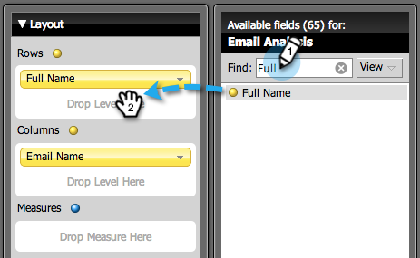

# 建立列出銷售線索的電子郵件分析報表{#build-an-email-analysis-report-that-lists-leads}

>[!AVAILABILITY]
>
>並非所有客戶都購買過此功能。 如需詳細資訊，請洽詢您的銷售代表。

請依照下列步驟建立「電子郵件分析」報表，以顯示每個傳送特定電子郵件的潛在客戶，此報表還將包含點按和開啟統計資料。 1.啟動收入總管。

1. 按一下&#x200B;**新建報告**。

   

1. 選擇「電子郵件分析」區域，然後按一下&#x200B;**確定**。

   

1. 尋找「電子郵件名稱」黃點，以滑鼠右鍵按一下它，然後選取&#x200B;**Filter**。

   

1. 連按兩下清單中您選擇的電子郵件，然後按一下「確定」。****

   

1. 將「電子郵件名稱」黃點拖曳至「欄」。

   

   >[!TIP]
   >
   >您可以新增許多銷售機會／公司屬性作為欄，請加以檢查！

1. 尋找「全名」黃點，並將其拖曳至「列」。

   

1. 現在，按兩下您感興趣的「測量」以新增這些測量。

   

>[!NOTE]
>
>根據您擁有此報表的資料量，重新整理此報表可能需要一段時間。

現在，您的報告完成後，應該會呈現如下效果：

任務完成！
