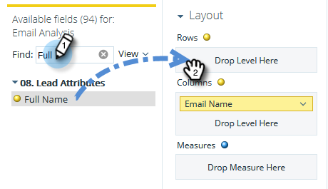

# 建立列出銷售機會的電子郵件分析報表 {#build-an-email-analysis-report-that-lists-leads}

請依照下列步驟建立電子郵件分析報表，該報表會顯示已傳送特定電子郵件的每個銷售機會，此報表也包含點按和開啟統計資料。

>[!AVAILABILITY]
>
>並非所有人都購買過此功能。 如需詳細資訊，請聯絡Adobe帳戶團隊（您的客戶經理）。

>[!NOTE]
>
>支援電子郵件分析RCA的資料引擎會忽略每人超過12次點按（如果點按來自相同的電子郵件和促銷活動）。 將「電子郵件分析」報表與標準Marketo Analytics報表進行比較時，請考量這一點。

1. Launch **收入總管**.

   

1. 按一下 **新建** then **報表**.

   

1. 選取「電子郵件分析」 ，然後按一下 **確定**.

   

1. 找到「電子郵件名稱」黃色圓點，按一下右鍵並選擇 **篩選**.

   

1. 連按兩下清單中您選擇的電子郵件，然後按一下 **確定**.

   

1. 拖曳 **電子郵件名稱** 黃點到 **欄**.

   

   >[!TIP]
   >
   >您可以新增許多銷售機會/公司屬性作為欄，請核取！

1. 尋找 **完整名稱** 黃色圓點拖曳至 **列**.

   

1. 現在新增 **措施** 按兩下它們，您就會感興趣。

   

>[!NOTE]
>
>根據您擁有此報表的資料量，重新整理可能需要一段時間。

任務完成！
