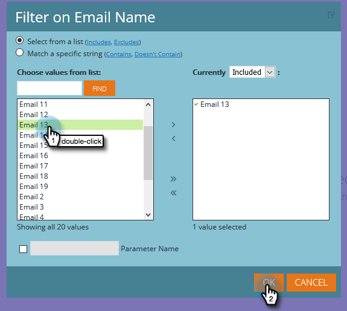

# 建立列出潛在客戶的電子郵件分析報告 {#build-an-email-analysis-report-that-lists-leads}

請依照下列步驟建立電子郵件分析報告，該報告將顯示每個傳送特定電子郵件的銷售機會，該報告還將包含「點按」和「開啟」統計資料。

>[!AVAILABILITY]
>
>並非每個人都購買過此功能。 如需詳細資訊，請聯絡Adobe客戶團隊（您的客戶經理）。

>[!NOTE]
>
>支援Email Analysis RCA的資料引擎會忽略每人超過12次點按（如果來自相同的電子郵件和促銷活動）。 比較電子郵件分析報表與標準Marketo Analytics報表時，請考量這一點。

1. Launch **收入總管**.

   

1. 按一下 **新建** 則 **報告**.

   

1. 選取電子郵件分析並按一下 **確定**.

   

1. 尋找電子郵件名稱黃點，用滑鼠右鍵按一下並選取 **篩選**.

   

1. 從清單中連按兩下您選擇的電子郵件，然後按一下 **確定**.

   

1. 拖曳 **電子郵件名稱** 黃色圓點加入 **欄**.

   

   >[!TIP]
   >
   >有許多銷售機會/公司屬性可供您新增為欄，請檢視它們！

1. 尋找 **全名** 黃色圓點，並將其拖曳至 **列**.

   

1. 現在新增 **測量** 連按兩下即可產生興趣。

   

>[!NOTE]
>
>根據您擁有此報告的資料量，可能需要一些時間重新整理。

任務完成！
