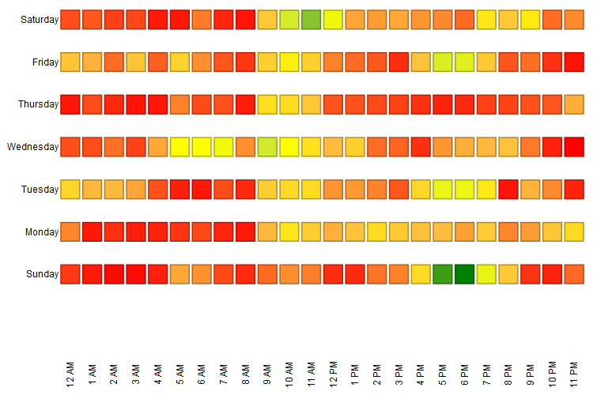

# 瞭解電子郵件分析區域 {#understanding-the-email-analysis-area}

電子郵件分析區域的重點是電子郵件量度。 本文章介紹其中可用的所有報表。

>[!AVAILABILITY]
>
>這可供擁有Select版本或 [Revenue Cycle Analytics](https://www.marketo.com/global-enterprise/marketo-revenue-cycle-analytics/) 附加元件。 如需詳細資訊，請聯絡您的銷售代表。

## 電子郵件點按活動熱格線 {#email-click-activity-heat-grid}

此報表會顯示潛在客戶在一週中的哪一天和一天中的哪個時間點按電子郵件。 越是綠色，在特定日期和時間點選的次數就越多。 目前的篩選器包含過去7天內傳送的所有電子郵件。 時間是成本值。

## 電子郵件點按時間分佈 {#email-clicked-time-distribution}

此報表顯示一天中每個時間的電子郵件點按總數的百分比。 目前的篩選器包含過去7天內傳送的所有電子郵件。 時間是成本值。

## 電子郵件點按率衰減 {#email-click-rate-decay}

此報表顯示了在傳送電子郵件的同一天及隨後的日子中，電子郵件點按總數的百分比。 目前的篩選條件包含7天前傳送的所有電子郵件。

## 電子郵件開啟活動熱格線 {#email-open-activity-heat-grid}

此報表會顯示潛在客戶在一週中的哪一天和一天中的哪個時間開啟電子郵件。 愈綠色的方塊，在特定日期和時間開啟的次數就會愈多。 目前的篩選器包含過去7天內傳送的所有電子郵件。 時間是成本值。

## 開啟率衰減 {#open-rate-decay}

此報表顯示了在傳送電子郵件的同一天及隨後的日子中，電子郵件開啟總數的百分比。 目前的篩選條件包含7天前傳送的所有電子郵件。

## 開啟時間分佈 {#open-time-distribution}

此報表會顯示一天中每個時間的電子郵件開啟總數的百分比。 目前的篩選器包含過去7天內傳送的所有電子郵件。 時間是成本值。

## 傳送活動熱格線 {#sent-activity-heat-grid}

此報表會顯示您在一週中的哪一天以及在一天中的哪個時間傳送電子郵件。 方塊愈綠色，在特定日期和時間傳送的電子郵件就愈多。 目前的篩選器包含過去7天內傳送的所有電子郵件。 時間是成本值。

