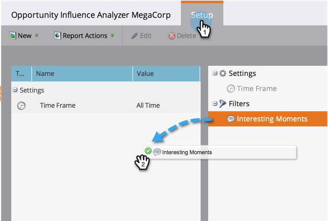

# 設定機會影響分析器 {#configure-an-opportunity-influence-analyzer}

一旦您 [建立機會影響分析器](/help/marketo/product-docs/reporting/revenue-cycle-analytics/opportunity-influence-analyzer/create-an-opportunity-influence-analyzer.md)，您可以設定 [有趣的時刻](/help/marketo/product-docs/marketo-sales-insight/msi-for-salesforce/features/tabs-in-the-msi-panel/interesting-moments/interesting-moments-overview.md) 已包括在內。

>[!PREREQUISITES]
>
>[建立機會影響分析器](/help/marketo/product-docs/reporting/revenue-cycle-analytics/opportunity-influence-analyzer/create-an-opportunity-influence-analyzer.md)

1. 按一下 **Analytics**.

   

1. 前往Analytics並選取您的Opportunity Influence Analyzer。

   

   如果分析器圖表中有太多有趣的時刻，您可以透過取消選取 **設定** 面板，或是減少有趣的時刻型別。

1. 若要設定要包含哪些型別的有趣時刻，請前往「設定」索引標籤，並在「有趣時刻」篩選器中拖曳。

   

1. 選擇顯示「全部」、「無」或「部分」。

   

1. 如果選擇「部分」，則可以選擇要包含的型別。

   

1. 按一下您想要的每個有趣時刻。 然後按一下 **儲存**.

1. 按一下主要索引標籤，即可檢視只有選取之有趣時刻型別的商機歷史記錄。

   

>[!MORELIKETHIS]
>
>[使用機會影響分析器訴說行銷故事](/help/marketo/product-docs/reporting/revenue-cycle-analytics/opportunity-influence-analyzer/tell-the-marketing-story-with-an-opportunity-influence-analyzer.md)
