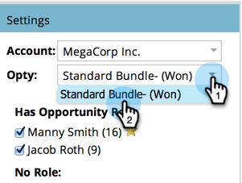

# 建立Opportunity Influce Analyzer {#create-an-opportunity-influence-analyzer}

使用Opportunity Influce Analyzer來顯示行銷對重要交易的貢獻。 查看您的計畫和活動成功案例，以及機會生命中的有趣時刻。

>[!NOTE]
>
>要從Opportunity Influence Analyzer獲取好的英特爾，請確保您的聯繫人與CRM中的商機相連。

1. 按一下 **Analytics**.

   

1. 按一下 **Opportunity Influce Analyzer**.

   

1. 從 **設定** 中。

   

   >[!NOTE]
   >
   >如果您收到警告，指出時間範圍內沒有任何活動，只需按一下 **關閉**. 下一步之後，我們再談。

1. 選擇該帳戶中的業務機會。

   

1. 設定時段。 按一下 **設定** 按兩下 **時間範圍**.

   

1. 選擇要分析的業務機會的時段，然後按一下 **儲存**.

   

   >[!TIP]
   >
   >
   >在大多數情況下， **所有時間** 是最簡單的選擇。

1. 你在那！ 按一下首頁簽，查看此機會中涉及的有趣時刻和成功。

   

>[!TIP]
>
>您也可以觀看有關Opportunity Influence Analyzer的影片，位於 [Marketo大學](https://learn.marketo.com). （現在看起來有點不同，但還有很多要學的！）

>[!MORELIKETHIS]
>
>* [使用Opportunity Influce Analyzer講述行銷故事](/help/marketo/product-docs/reporting/revenue-cycle-analytics/opportunity-influence-analyzer/tell-the-marketing-story-with-an-opportunity-influence-analyzer.md)
>* [配置Opportunity Influce Analyzer](/help/marketo/product-docs/reporting/revenue-cycle-analytics/opportunity-influence-analyzer/configure-an-opportunity-influence-analyzer.md)

