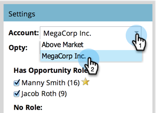
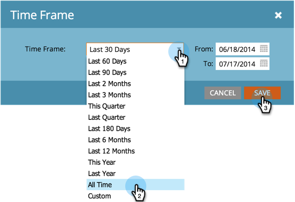

# 建立機會影響分析器 {#create-an-opportunity-influence-analyzer}

使用Opportunity Influce Analyzer來顯示行銷對重要交易的貢獻。 在機會的生活中，查看您的計畫和活動成功案例以及有趣的時刻。

>[!NOTE]
>
>**提醒**
>
>要從Opportunity Influction Analyzer獲得好的英特爾，請確保您的聯繫人與CRM中的機會相連。

1. 按一 **下Analytics**。

   

1. 按一下 **Opportunity Inflement Analyzer**。

   

1. 從「設定」面板中選 **取帳戶** 。

   

   >[!NOTE]
   >
   >如果您收到警告，指出該時段內沒有活動，只需按一下「關 **閉」**。 下一步再談。

1. 在該帳戶中選擇業務機會。

   

1. 設定時段。 按一下「 **Setup** （設定）」頁籤，然後按兩下「 **Time Frame（時間幀）**」。

   

1. 選擇要分析的業務機會的時段，然後按一下 **保存**。

   

   >[!TIP]
   >
   >
   >在大多數情況下， **「所有時間** 」是最簡單的選擇。

1. 你在那！ 按一下主頁籤，查看此機會中涉及的有趣時刻和成功。

   

>[!TIP]
>
>您也可以觀看有關 [Marketo University中Opportunity Influce Analyzer的影片](https://learn.marketo.com)。 （現在看起來有些不同，但還有很多要學的！）

>[!MORELIKETHIS]
>
>* [使用Opportunity Inflection Analyzer講述行銷故事](tell-the-marketing-story-with-an-opportunity-influence-analyzer.md)
>* [配置Opportunity Effence Analyzer](configure-an-opportunity-influence-analyzer.md)

>

>[!NOTE]
>
>**深入探討**
>
>如需其他分析器，請參 [閱基本報表](http://docs.marketo.com/display/docs/basic+reporting)。

