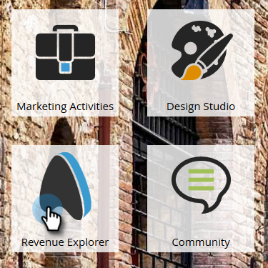
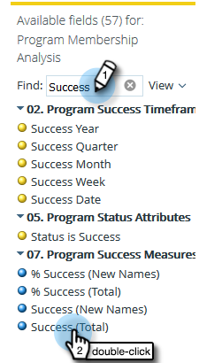

# 建置會列出商機的方案會籍分析報告 {#build-a-program-membership-analysis-report-that-lists-leads}

按照以下步驟建立方案成員資格分析報告，顯示所有的方案成員名稱。

>[!AVAILABILITY]
>
>並非所有Marketo Engage使用者都已購買此功能。 如需詳細資訊，請聯絡Adobe客戶團隊（您的客戶經理）。

1. 啟動&#x200B;**[!UICONTROL Revenue Explorer]**。

   

1. 按一下&#x200B;**[!UICONTROL Create New]**，然後再按&#x200B;**[!UICONTROL Report]**。

   

1. 選取「**[!UICONTROL Program Membership Analysis]**」然後按一下「**[!UICONTROL OK]**」。

   

1. 尋找並連按兩下&#x200B;**[!UICONTROL Program Name]**&#x200B;黃點。

   

1. 尋找並連按兩下&#x200B;**[!UICONTROL Members]**&#x200B;藍點。

   

1. 尋找並連按兩下&#x200B;**[!UICONTROL Success (Total)]**&#x200B;藍點。

   

看看這有多容易？

您可以快速新增潛在客戶屬性，例如&#x200B;_[!UICONTROL Full Name]_，以檢視成員是誰。

>[!TIP]
>
>有許多銷售機會/公司屬性可供選擇。 立即檢視！

1. 尋找並連按兩下&#x200B;**[!UICONTROL Full Name]**&#x200B;黃點。

   

您有！

