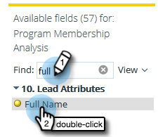

# 建立列出銷售機會的方案成員資格分析報告 {#build-a-program-membership-analysis-report-that-lists-leads}

按照下列步驟建立「方案成員身份分析」報告，該報告將顯示所有方案成員名稱。

>[!AVAILABILITY]
>
>並非所有客戶都購買過此功能。 如需詳細資訊，請連絡您的銷售代表。

1. 啟動收入總管。

   

1. 按一下 **新建** then **報表**.

   

1. 選擇 **方案成員分析** 按一下 **確定**.

   

1. 查找並按兩下程式名黃色圓點。

   

1. 查找並按兩下成員藍點。

   

1. 尋找並連按兩下成功（總計）藍點。

   

看那有多容易？

您可以快速新增銷售機會屬性，例如 _完整名稱_ 看看會員是誰。

>[!TIP]
>
>有大量銷售機會/公司屬性可供選擇。 看看他們！

1. 尋找並連按兩下 **完整名稱** 黃點。

   

給你！

