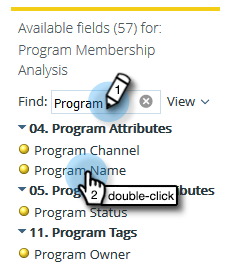

# 建立列出潛在客戶的計畫會員資格分析報告 {#build-a-program-membership-analysis-report-that-lists-leads}

請依照下列步驟建立方案成員資格分析報告，顯示所有的方案成員名稱。

>[!AVAILABILITY]
>
>並非所有客戶都已購買此功能。 如需詳細資訊，請聯絡您的銷售代表。

1. 啟動Revenue Explorer。

   

1. 按一下 **新建** 則 **報告**.

   

1. 選取 **計畫會籍分析** 並按一下 **確定**.

   

1. 尋找並連按兩下程式名稱yellow dot。

   

1. 尋找並連按兩下「成員」藍點。

   

1. 尋找並連按兩下Success (Total)藍點。

   

看看這有多容易？

您可以快速新增潛在客戶屬性，例如 _全名_ 檢視成員身分。

>[!TIP]
>
>有許多銷售機會/公司屬性可供選擇。 立即檢視！

1. 尋找並連按兩下 **全名** 黃色圓點。

   

給你！

