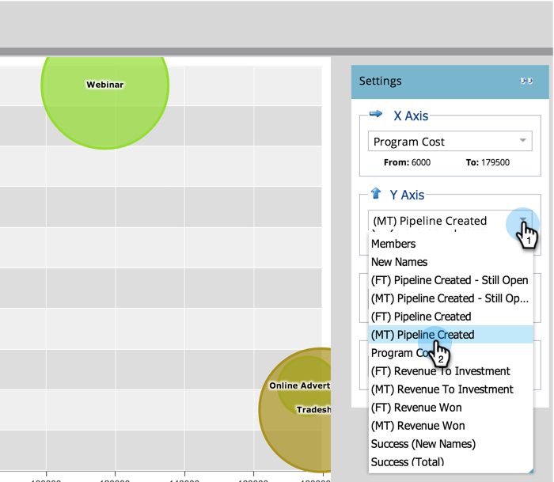

# 使用Program Analyzer比較管道成效 {#compare-channel-effectiveness-with-the-program-analyzer}

使用Program Analyzer來比較管道成本、成員贏取、管道、收入等，以找出您最有效與最不有效的管道。

>[!PREREQUISITES]
>
>[建立程式分析器](/help/marketo/product-docs/reporting/revenue-cycle-analytics/program-analytics/create-a-program-analyzer.md)

1. 按一下 **Analytics** 在 **我的Marketo**.

   

1. 選取您的 **程式分析器**.

   

1. 將檢視變更為 **依頻道**.

   

1. 使用 **X軸** 下拉式清單，選擇水平軸的量度。 開始吧 **計畫成本**.

   

1. 使用「Y軸」下拉式清單，選擇垂直軸的量度。 這裡，我們繼續 **(FT)管道已建立**.

   

   >[!NOTE]
   >
   >您可在程式分析器中選擇的許多量度，都適用於首次接觸(FT)和多點接觸(MT)計算。 瞭解 [FT和MT歸因的差異](/help/marketo/product-docs/reporting/revenue-cycle-analytics/revenue-tools/attribution/understanding-attribution.md).

1. 使用 **Y軸** 下拉式選單 **(MT)管道已建立**.

   

   在此多點接觸歸因檢視中，我們發現網路研討會頻道對建立的管道影響較大，且成本低於貿易展和線上廣告頻道。

   現在，再新增兩個維度吧！

1. 使用 **泡泡大小** 下拉式清單以選取其他測量，例如 **新名稱**.

   

1. 觀看圖表如何變更。

   

   我們看到網路研討會頻道縮小，測量方式為 **新名稱**. 我們可以得出結論，雖然此組織擁有許多成員，但在創造新銷售機會方面不如貿易展覽頻道有效。

1. 最後，使用顏色下拉式清單來新增第四個維度。 讓我們選取 **(FT)贏得的收入**.

   

1. 觀察圖形中的色彩變化。

   

   從顏色中，我們瞭解到，貿易展覽管道（最環保的泡泡）影響了透過首次接觸歸因衡量的最大收入。

1. 現在，如果我們將顏色量度變更為 **(MT)贏得的收入**&#x200B;我們發現，目前最環保的線上廣告頻道，隨著時間的推移，其收入比網路研討會及商展頻道受到的影響更大。

   

在我們的範例中，在測量由首次接觸建立的配管時，貿易展覽管道是最昂貴（最靠右）和最成功（Y軸最高）的管道。 現在，讓我們考慮每個頻道中透過多重接觸歸因所建立的管道。

>[!TIP]
>
>這些步驟中的範例會根據建立的管道來測量成效。 使用Y軸下拉式清單來選取其他測量管道效益的方式，例如新名稱、成員、每次成功的成本等。

>[!MORELIKETHIS]
>
>* [使用方案分析器探索方案和管道詳細資訊](/help/marketo/product-docs/reporting/revenue-cycle-analytics/program-analytics/explore-program-and-channel-details-with-the-program-analyzer.md)
>* [使用方案分析器比較方案效能](/help/marketo/product-docs/reporting/revenue-cycle-analytics/program-analytics/compare-program-effectiveness-with-the-program-analyzer.md)
