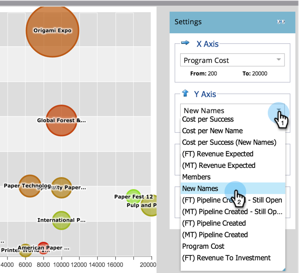
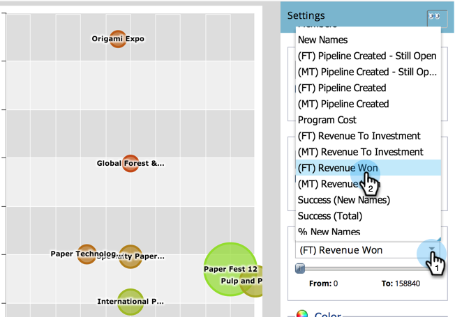

# 與程式分析器比較程式效果 {#compare-program-effectiveness-with-the-program-analyzer}

使用Program Analyzer通過比較計畫成本、成員獲取、管道和收入來確定最有效和最低效的計畫。

>[!PREREQUISITES]
>
>[建立程式分析器](/help/marketo/product-docs/reporting/revenue-cycle-analytics/program-analytics/create-a-program-analyzer.md)

1. 按一下 **Analytics**.

   

1. 選擇程式分析器。

   

1. 將「視圖」更改為「按程式」。

   

1. 使用「管道篩選器」將檢視減少為一或兩個管道。 目前，我們將看展會頻道的節目。

   

   >[!TIP]
   >
   >只要選取一個通道，便可快速篩選程式 **檢視** > **依管道**，按一下該管道的泡泡，然後在快顯對話方塊中按一下管道名稱。

1. 使用「X軸」下拉式清單來選擇水準軸的量度。 從計畫成本開始。

   

1. 使用「Y軸」下拉式清單來選擇垂直軸的量度。 讓我們選擇「新名稱」來查找擅長捕獲新線索的程式。

   

1. 開啟滑桿以放大。

   

   >[!TIP]
   >
   >您也可以嘗試透過從線性變更為對數刻度來改善檢視，反之亦然。 使用 **規模** 功能表。

1. 探索產生的圖表。

   

   在我們的例子中，我們學習「摺紙」博覽比該頻道的所有其他節目都要好得多，它以中等的成本獲取新的名稱。 但這不是全部。 我們將再新增兩個量度，以更深入了解。

1. 使用「泡泡大小」下拉式清單，選擇要依泡泡大小比較的量度。 以我們的例子，我們將選擇(FT)收入贏。

   

   >[!NOTE]
   >
   >您可在程式分析器中選擇的許多量度都提供首次接觸(FT)和多次接觸(MT)計算。 了解 [FT和MT歸因的差異](/help/marketo/product-docs/reporting/revenue-cycle-analytics/revenue-tools/attribution/understanding-attribution.md).

1. 觀察圖形中的泡泡變更大小。

   

   新增 **(FT)收入韓元**&#x200B;我們很快發現，雖然「摺紙展」獲得了很多新名字，但收入卻相對較少。 另外，我們還看到，「紙藝節」12節的名字越來越少，但更好，因為它影響了更多收入（更大的泡沫）。

1. 使用「顏色」下拉式清單來新增第四個量度。 我們將看(FT)投資收益。

   

1. 觀看圖表中的顏色變更。

   

我們看到，紙展12節不僅影響更多收入（更大的泡沫），而且儘管節目成本相對較高（在最右邊），它在貿易展渠道的所有節目中投資回報（最環保的泡沫）最佳。

>[!TIP]
>
>您可以快速比較一個管道中的方案與另一個管道中的方案。 只要使用 **通道篩選** 以新增更多管道。

>[!MORELIKETHIS]
>
>* [使用Program Analyzer探索Program &amp; Channel詳細資訊](/help/marketo/product-docs/reporting/revenue-cycle-analytics/program-analytics/explore-program-and-channel-details-with-the-program-analyzer.md)
>* [比較渠道有效性與程式分析器](/help/marketo/product-docs/reporting/revenue-cycle-analytics/program-analytics/compare-channel-effectiveness-with-the-program-analyzer.md)

