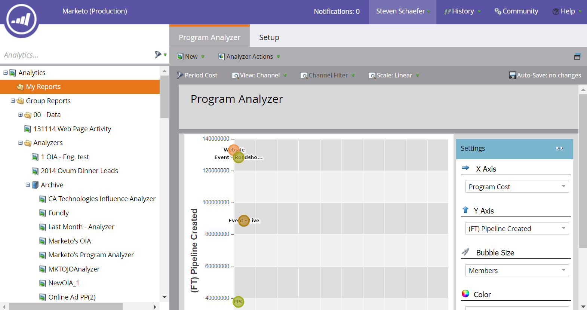

# 建立程式分析器 {#create-a-program-analyzer}

探索哪些程式和管道可為您的行銷投入帶來最大的效益。 使用方案分析器可依方案或管道詳細檢視及比較每項成本與回報。

>[!NOTE]
>
>若要從計劃分析器取得良好的資料，請確定您的CRM連絡人在機會中擁有角色，並且您的Marketo計畫已透過進行完整設定 [期間成本](/help/marketo/product-docs/reporting/revenue-cycle-analytics/revenue-tools/define-period-costs.md)、計畫狀態和定義的成功案例。

>[!TIP]
>
>若要讓無成本的程式出現在程式分析器中， [設定其期間成本](/help/marketo/product-docs/reporting/revenue-cycle-analytics/revenue-tools/define-period-costs.md) 至$0。

1. 按一下 **分析** 圖磚。

   

1. 按一下 **程式分析器** 圖磚。

   

1. 標準程式分析器隨即出現。 進行您所需的任何變更。

   

1. 按一下 **設定** 索引標籤以新增和自訂篩選器。

   

1. 例如，若要自訂「期間成本」篩選器，請連按兩下該篩選器。

   

1. 選取您要分析的時間段並按一下 **套用**.

   

   >[!TIP]
   >
   >若要選取特定範圍，請選取 **自訂** 並使用 **從** 和 **至** 欄位。

1. 如果您想要儲存新的自訂分析器，請在「分析器動作」下拉式清單中選取 **另存為**.

   

1. 使用「儲存至」和「資料夾」下拉式清單，選取您要儲存自訂分析器的位置。 為新的自訂分析器命名。 說明為選用。 按一下 **儲存**.

   

1. 您已完成！ 按一下主要標籤，開始探索和比較您的程式和頻道。

>[!NOTE]
>
>您可在程式分析器中選擇的許多量度，都可透過首次接觸(FT)和多點接觸(MT)計算使用。 瞭解 [FT和MT歸因的差異](/help/marketo/product-docs/reporting/revenue-cycle-analytics/revenue-tools/attribution/understanding-attribution.md).

>[!MORELIKETHIS]
>
>* [使用Program Analyzer比較管道成效](/help/marketo/product-docs/reporting/revenue-cycle-analytics/program-analytics/compare-channel-effectiveness-with-the-program-analyzer.md)
>* [使用計劃分析器比較計畫成效](/help/marketo/product-docs/reporting/revenue-cycle-analytics/program-analytics/compare-program-effectiveness-with-the-program-analyzer.md)
>* [透過計劃分析器探索計畫和管道的詳細資訊](/help/marketo/product-docs/reporting/revenue-cycle-analytics/program-analytics/explore-program-and-channel-details-with-the-program-analyzer.md)
>* [復製程式分析器](/help/marketo/product-docs/reporting/revenue-cycle-analytics/program-analytics/clone-a-program-analyzer.md)
