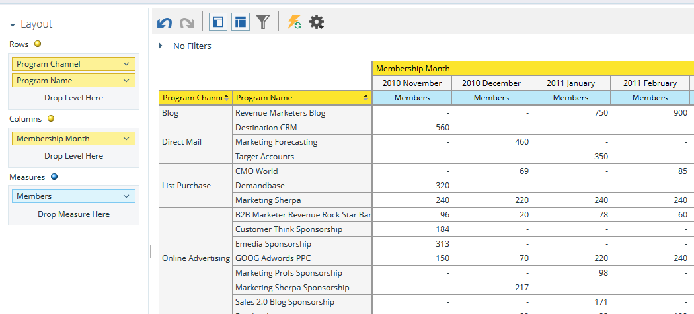

# 瞭解方案會員分析區域{#understanding-the-program-membership-analysis-area}

方案會員分析區可讓您分析個別方案的成效，或查看特定時段內依通道的摘要結果。

## 業務問題示例{#example-business-questions}

在指定的月份中，有多少人透過不同管道參與一個節目？

有多少人達到特定計畫的成功標準？

每個方案／頻道每月產生多少個新名稱？

## 方案會員分析維度與措施{#program-membership-analysis-dimensions-and-measures}

>[!NOTE]
>
>黃點是尺寸，藍點是測量。

### 會員資格{#membership}

| 測量 | 說明 |
|---|---|
| %新名稱 | 在方案中獲得的銷售機會百分比 |
| 成員 | 計畫中的銷售機會總數 |
| 新名稱 | 程式獲取的新名稱總數 |

### 程式屬性{#program-attributes}

| 維 | 說明 |
|---|---|
| 方案頻道 | 方案頻道 |
| 方案名稱 | 方案名稱 |

### 方案會員時間範圍{#program-membership-timeframe}

| 維 | 說明 |
|---|---|
| 年 | 方案會員期限 |
| 季度 | 方案會員期限 |
| 月 | 方案會員期限 |
| 周 | 方案會員期限 |
| 日期 | 方案會員期限 |

### 成功{#success}

| 測量 | 說明 |
|---|---|
| 成功%（新名稱） | 方案AND獲得的銷售機會在方案進展中成功的百分比 |
| 成功百分比（總計） | 在計畫進展中成功的銷售線索百分比 |
| 成功（新名稱） | 在方案進展中取得成功的新姓名總數 |
| 成功（總計） | 在計畫進展中取得成功的潛在客戶總數 |
