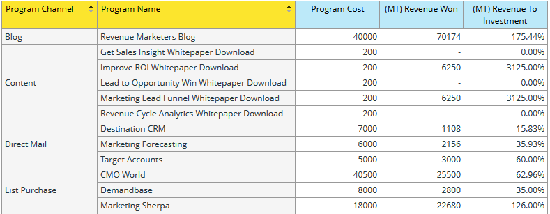

# 了解計畫機會分析領域 {#understanding-the-program-opportunity-analysis-area}

## 總覽 {#overview}

通過「計畫機會分析」區域，您可以分析各個計畫的有效性，或按計畫渠道查看匯總結果。

**您可以使用此分析區域回答的業務問題示例包括**:

有多少機會與給定的計畫關聯，有多少機會與我們贏得了？

指定的計畫或渠道幫助產生了多少收入？

特定計畫或渠道的收入對投資額是多少？

指定的計畫對哪些機會產生了影響？

## 計畫機會分析歸因度量（藍點） {#program-opportunity-analysis-attribution-measures-blue-dots}

可用於分析的測量通常是數字，並由藍點表示。 Dimension是可提供測量不同檢視的屬性，以黃點表示。

所有測量（藍點）都與歸因相關 — 銷售機會贏取或與銷售機會相關的銷售成功的「評分」。

 

有三種措施：

* 贏取相關測量，可取得首次接觸歸因(FT)。
* 成功相關測量，接收多點接觸歸因(MT)。
* 與Misceloneal Program相關的度量，包括建立或關閉Opportunity之前的平均市場接觸次數。

## 贏取和成功相關措施 {#acquisition-and-success-related-measures}

與採購相關的措施給予首次獲得銷售線索聯繫資訊的計畫評價。 銷售機會不必在要授予的贏取評分計畫中取得成功。

取得指定銷售機會的值會隨著時間而改變。 直到銷售線索進行購買為止。 然後，購買次數就會增加。

與成功相關的措施將歸功於所有有助於領導人購買計畫的方案。

與贏取一樣，對銷售線索進行的銷售貢獻的價值會隨著時間而改變，並且在銷售線索進行某些購買之前為零。

<table> 
 <tbody> 
  <tr> 
   <th>歸因測量 — 機會相關（FT或MT）*</th> 
   <th>說明</th> 
  </tr> 
  <tr> 
   <td>機會成本</td> 
   <td>影響機會的方案成本部分。 如果涉及多個線索，則成本可能被分攤。</td> 
  </tr> 
  <tr> 
   <td>已建立的業務機會</td> 
   <td>為影響機會的創造而接收的方案的信用部分。 如果涉及多個線索，可能只是一小部分。</td> 
  </tr> 
  <tr> 
   <td>贏得的機會</td> 
   <td>為影響贏得的機會而接收的計畫的評分部分。 如果涉及多個線索，可能只是一小部分。</td> 
  </tr> 
  <tr> 
   <td>管道已建立</td> 
   <td>為影響機會的創造而接收的方案的信用部分（貨幣價值）。 如果涉及多個線索，可能只是一小部分。</td> 
  </tr> 
  <tr> 
   <td>管道已建立 — 仍開啟</td> 
   <td>為影響當前開放機會的建立而接收的方案的信用部分（以貨幣價值計）。 如果涉及多個線索，可能只是一小部分。</td> 
  </tr> 
  <tr> 
   <td>預期收入</td> 
   <td>為影響機會的創造而接收的方案的信用部分（貨幣價值）。 預期收入是機會概率乘以機會價值。 如果涉及多個線索，可能只是一小部分。</td> 
  </tr> 
  <tr> 
   <td>投資收入</td> 
   <td>這是為影響贏得的機會而接收的方案的信用部分（以貨幣價值計）與方案成本的比率。</td> 
  </tr> 
  <tr> 
   <td>收入韓元</td> 
   <td>為影響贏得的機會而接收的方案的信用部分（以貨幣價值計）。 如果涉及多個線索，可能只是一小部分。</td> 
  </tr> 
 </tbody> 
</table>

_&#42;(FT)=首次接觸歸因，用於銷售機會贏取量度；(MT)=多點接觸歸因，用於銷售機會成功的測量_

下面是一個方案，說明當有兩個程式生成銷售機會時如何計算銷售機會單位，但這些銷售機會從同一帳戶導致一個銷售機會。

**方案1**

* 生成一個銷售線索：Lead 1
* 銷售機會1來自帳戶1

**方案2**

* 生成另一個銷售線索：Lead 2
* 銷售線索2也來自帳戶1

**帳戶1**

* 生成一個Opportunity:機會1

Marketo可適當提供評分，而不會重複計算不同計畫的機會。 因此，在此實例中，每個程式都接收0.5個機會單位。 也就是說，每個Program都會獲得生成的Opportunity的一半評分。 另外，與Opportunity關聯的收入的一半分配給每個Program。

## 與方案有關的雜項措施 {#miscellaneous-program-related-measures}

現有的其他措施反映了方案的總體業績。

<table> 
 <tbody> 
  <tr> 
   <th>歸因測量 — 與方案相關的</th> 
   <th>說明</th> 
  </tr> 
  <tr> 
   <td>與計畫關聯的機會數</td> 
   <td>
已將任何歸因評分給某個計畫的Opportunity總數。 機會可能受一個或多個銷售機會以及一個或多個計畫的影響。
</td> 
  </tr> 
  <tr> 
   <td>每封閉機會的平均成功次數</td> 
   <td>在Opportunity關閉之前Program成功的平均數。  </td> 
  </tr> 
  <tr> 
   <td>每個機會建立的平均成功數</td> 
   <td>在建立Opportunity之前成功的Programs的平均數。</td> 
  </tr> 
  <tr> 
   <td>新名稱</td> 
   <td>方案獲取的新名稱（即新銷售機會）的總數。</td> 
  </tr> 
  <tr> 
   <td>計畫成本</td> 
   <td>方案總費用。</td> 
  </tr> 
  <tr> 
   <td>成功（總計）</td> 
   <td>成功的方案成員總數。</td> 
  </tr> 
 </tbody> 
</table>

## 計畫機會分析Dimension（黃點） {#program-opportunity-analysis-dimensions-yellow-dots}

測量（藍點）經過計算，需要一些思考和說明才能使用，而維度（黃點）則是描述性的。 可用的維度如下。

<table> 
 <tbody> 
  <tr> 
   <th>類別</th> 
   <th>顯示標籤</th> 
  </tr> 
  <tr> 
   <td>機會屬性</td> 
   <td>業務機會已關閉 機會名稱* 業務機會所有者名稱 機會階段 機會類型</td> 
  </tr> 
  <tr> 
   <td>機會時間範圍</td> 
   <td>業務機會已結年/季/月 已建立的業務機會年/季/月</td> 
  </tr> 
  <tr> 
   <td>方案屬性</td> 
   <td>節目頻道 方案名稱</td> 
  </tr> 
  <tr> 
   <td>方案成本時間範圍</td> 
   <td>成本年/季/月</td> 
  </tr> 
 </tbody> 
</table>

*&#42;所有將任何類型的歸因評分給予Program的Opportunity。 機會可能受一個或多個銷售機會以及一個或多個計畫的影響。*

>[!MORELIKETHIS]
>
>[建立收入總管報表](/help/marketo/product-docs/reporting/revenue-cycle-analytics/revenue-explorer/create-a-revenue-explorer-report.md)
