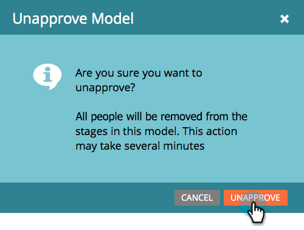

# 核准/取消核准收入模型 {#approve-unapprove-a-revenue-model}

在任何指定時間，您只能有一個已核准的模型。

>[!CAUTION]
>
>[必須核准個別階段](/help/marketo/product-docs/reporting/revenue-cycle-analytics/revenue-cycle-models/approving-stages-and-assigning-leads-to-a-revenue-model.md) 和在您核准整個模型之前新增的人員。

## 核准 {#approve}

1. 前往 **分析** 區域。

   

1. 從樹狀結構中選取模型。

   

1. 從 **模型動作** 功能表，選擇 **核准模型**.

   

1. 隨即顯示一個對話方塊，確認您的選擇。 按一下 **核准**.

   

您的模型現在已上線！

## 取消核准 {#unapprove}

>[!CAUTION]
>
>如果您取消核准模型，則會從模型中移除所有人員，並刪除他們在模型中的歷史記錄！

1. 前往 **分析** 區域。

   

1. 從樹狀結構中選取模型。

   

1. 按一下 **模型動作** 功能表並選擇 **取消核准模型**.

   

1. 在出現的對話方塊中，按一下 **取消核准模型**.

   

恭喜！ 您的模型現在未核准。

>[!CAUTION]
>
>取消核准模型會從模型中移除所有人員，並從資料庫中移除其在模型中的歷史記錄。
