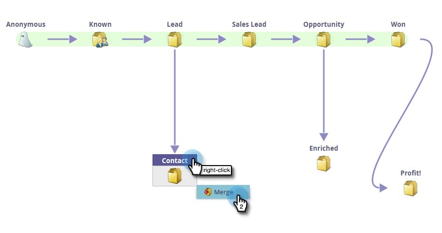

# 編輯已核准的模型 {#editing-your-approved-model}

## 編輯模型 {#editing-your-model}

1. 在Analytics區段中選取您要變更的模型，然後按一下 **編輯草稿**.

   

1. 在編輯草稿模型時（在模型獲得批准後），不能刪除階段。 相反，您可以將該階段與模型中的另一個階段合併。 按一下右鍵要合併的舞台，然後按一下 **合併**.

   

1. 為當前所選銷售線索選擇新階段，或選擇 **無** 從模型中移除銷售線索。 完成後，按一下 **合併**.

   

1. 對模型進行變更後，請選取 **批准模型草稿** 在 **模型動作** 功能表。

   

   >[!TIP]
   >
   >如果對階段進行任何更改（如添加或合併），請確保更改分配規則和階段以反映您的編輯。

## 取消核准模型 {#unapproving-your-model}

>[!CAUTION]
>
>如果您取消核准模型，其所有銷售機會都會遭到移除，且其在模型中的歷史記錄將會遭到刪除。 請考慮編輯模型，而非取消核准。

1. 選取要取消核准的模型。 從 **模型動作** 菜單，選擇 **取消核准模型**.

   

1. 按一下 **取消核准**.

   

>[!NOTE]
>
>如果要重新批准此模型，則首先需要將銷售線索重新分配給各個階段。

## 建立更多模型 {#creating-more-models}

一次只能有一個已核准的模型。 如果您想要核准模型，但已核准一個模型，請先取消核准目前的模型。 如果可能，請嘗試編輯模型，而不是建立新模型。

>[!MORELIKETHIS]
>
>[建立新的收入模型](/help/marketo/product-docs/reporting/revenue-cycle-analytics/revenue-cycle-models/create-a-new-revenue-model.md)
