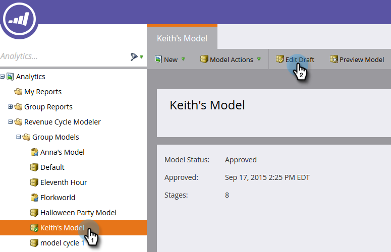

# 編輯已批准的型號{#editing-your-approved-model}

## 編輯模型{#editing-your-model}

1. 在「分析」區段中選取您要變更的模型，然後按一下「編輯草稿&#x200B;**」。**

   

1. 在編輯繪製模型時（在模型被批准後），不能刪除階段。 相反，您可以將該舞台與模型中的另一個舞台合併。 按一下右鍵要合併的舞台，然後按一下&#x200B;**Merge**。

   

1. 為當前處於選定狀態的銷售線索選擇新階段，或選擇&#x200B;**無**&#x200B;從模型中刪除銷售線索。 完成後，按一下&#x200B;**Merge**。

   

1. 完成對模型的更改後，在&#x200B;**「模型操作」(Model Actions)**&#x200B;菜單中選擇「批准模型草稿」(Approve Model Draft)**，重新批准該模型。**

   

   >[!TIP]
   >
   >如果您對階段進行了任何更改（如添加或合併），請確保更改分配規則和階段以反映您所做的編輯。

## 取消批准您的型號{#unapproving-your-model}

>[!CAUTION]
>
>如果取消批准模型，則其所有銷售線索都將被刪除，其在模型中的歷史記錄將被刪除。 請考慮編輯模型，而非取消核准。

1. 選擇要取消批准的模型。 從&#x200B;**模型操作**&#x200B;菜單中，選擇&#x200B;**取消批准模型**。

   

1. 按一下&#x200B;**取消批准**。

   

>[!NOTE]
>
>如果要重新批准此模型，您首先需要將銷售線索重新分配給各個階段。

## 建立更多模型{#creating-more-models}

一次只能有一個已批准的模型。 如果您想要核准模型，但已核准模型，則必須先取消核准目前的模型。 如果可能，請嘗試編輯模型，而不是建立新模型。

>[!MORELIKETHIS]
>
>[建立新的收入模型](/help/marketo/product-docs/reporting/revenue-cycle-analytics/revenue-cycle-models/create-a-new-revenue-model.md)
