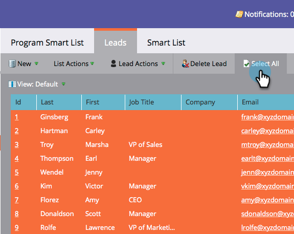

# 批准階段和分配銷售線索至收入模型 {#approving-stages-and-assigning-leads-to-a-revenue-model}

取得您的 **收入模型** 通過添加現有銷售線索來啟動和運行，為任何新銷售線索建立分配規則。

## 批准階段 {#approving-stages}

在您新增任何銷售機會之前，請先核准模型的各個階段。

1. 前往 **Analytics** 的上界。

   

1. 選擇要批准其階段的模型。

   

1. 在 **模型動作**，選取 **核准階段**.

   

1. 你會收到警報；按一下 **分配銷售機會**.

   

太棒了！ 讓我們繼續分配這些線索。

## 分配現有銷售機會 {#assigning-existing-leads}

[建立智慧清單](/help/marketo/product-docs/core-marketo-concepts/smart-lists-and-static-lists/creating-a-smart-list/create-a-smart-list.md) 在銷售機會資料庫中確定模型的一個階段的銷售機會。

1. 一旦您 [已建立智慧清單](/help/marketo/product-docs/core-marketo-concepts/smart-lists-and-static-lists/creating-a-smart-list/create-a-smart-list.md)，按一下 **銷售機會** 標籤。

   

1. 按一下 **全選** 來選擇銷售機會。

   

1. 開啟 **銷售機會動作** 下拉式清單並選取 **特殊**. 按一下 **變更收入階段**.

   

1. 選擇正確的 **模型** 而且正確 **階段**. 按一下 **立即運行**.

   

1. 重複，直到所有銷售機會被分配給模型的各個階段。

太棒了！ 要指定如何將新銷售線索分配給各階段，請建立分配規則。

>[!NOTE]
>
>如果您的模型處於「已核准的階段」狀態，您將不會在銷售機會的活動記錄中看到任何「變更收入階段」事件。 如果您的模型已完全核准，如果您將銷售機會移至其目前所在的相同階段，則會略過此流程步驟。

## 新銷售機會：建立分配規則  {#new-leads-create-assignment-rules}

1. 按一下 **Marketo首頁** 再次，然後選取 **Analytics**.

   

1. 在樹中按一下模型，然後按一下 **模型動作** 菜單，選擇 **分配規則**.

   

1. 如果您的分配規則包含多個預設選項，請按一下 **階段**，進行選取，然後按一下 **添加選擇**.

   

## 分配規則示例 {#example-assignment-rule}

建立銷售機會分數規則，以將具有最低分數的新銷售機會指派給適當的步驟。

1. 在 **若**，選取 **銷售機會分數**. 然後選擇 **至少**.

   

1. 輸入 **40** 在欄位中選取 **銷售線索** 作為舞台。 按一下 **儲存** 完成。

   

>[!MORELIKETHIS]
>
>若要核准您的模型，請閱讀我們的說明頁面，位於 **[核准和取消核准收入模型](/help/marketo/product-docs/reporting/revenue-cycle-analytics/revenue-cycle-models/approve-unapprove-a-revenue-model.md)**.
