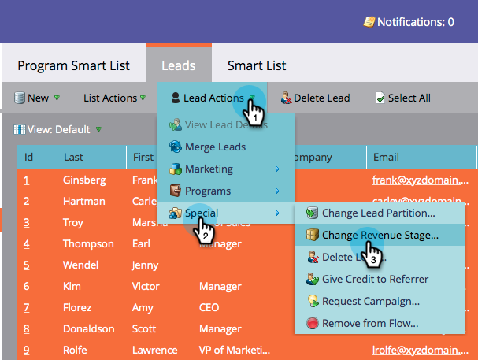
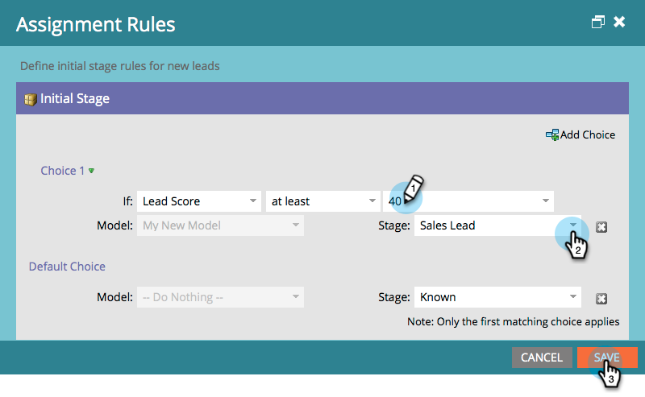

# 批准階段並將銷售線索分配給收入模型{#approving-stages-and-assigning-leads-to-a-revenue-model}

通過添加現有銷售線索，為任何新銷售線索建立分配規則，使&#x200B;**收入模型**&#x200B;啟動並運行。

## 批准階段{#approving-stages}

讓我們在您新增任何銷售機會之前，先核准模型的階段。

1. 前往&#x200B;**Analytics**&#x200B;區域。

   

1. 選擇要批准其階段的模型。

   

1. 在&#x200B;**Model Actions**&#x200B;下，選擇&#x200B;**Approve Stages**。

   

1. 你會收到警報；按一下&#x200B;**分配銷售線索**。

   

太棒了！ 讓我們繼續，指派這些線索。

## 分配現有銷售線索{#assigning-existing-leads}

[建立智慧列](/help/marketo/product-docs/core-marketo-concepts/smart-lists-and-static-lists/creating-a-smart-list/create-a-smart-list.md) 表，以在銷售線索資料庫中標識模型的一個階段的銷售線索。

1. 在[建立智慧清單後，按一下&#x200B;**Leads**&#x200B;頁籤。](/help/marketo/product-docs/core-marketo-concepts/smart-lists-and-static-lists/creating-a-smart-list/create-a-smart-list.md)

   

1. 按一下&#x200B;**選擇全部**&#x200B;以選擇銷售線索。

   

1. 開啟&#x200B;**Lead Actions**&#x200B;下拉式清單，然後選擇&#x200B;**Special**。 按一下&#x200B;**更改收入階段**。

   

1. 選擇正確的&#x200B;**Model**&#x200B;和正確的&#x200B;**Stage**。 按一下&#x200B;**立即運行**。

   

1. 重複此步驟，直到所有銷售線索都分配到模型的各個階段。

太好了！ 要指定如何將新銷售線索分配給各階段，請建立分配規則。

>[!NOTE]
>
>如果模型處於「批准的階段」狀態，您將不會在銷售線索的活動日誌中看到任何「更改收入階段」事件。 如果模型已完全批准，如果將銷售線索移動到當前所在的同一階段，則將跳過此流步驟。

## 新銷售線索：建立分配規則{#new-leads-create-assignment-rules}

1. 再次按一下「Marketo首頁」**，然後選取「** Analytics **」。**

   

1. 按一下樹中的模型，然後選擇&#x200B;**Model Actions**&#x200B;菜單，選擇&#x200B;**Assignment Rules**。

   

1. 如果您的指派規則包含多個預設選項，請按一下&#x200B;**Stage**，進行選擇，然後按一下&#x200B;**Add Choice**。

   

## 分配規則示例{#example-assignment-rule}

建立銷售線索分數規則，以將分數最低的新銷售線索指派給適當的步驟。

1. 在&#x200B;**If**&#x200B;下，選擇&#x200B;**Lead Score**。 然後選擇&#x200B;**至少**。

   

1. 在欄位中輸入&#x200B;**40** ，然後選擇&#x200B;**銷售線索**&#x200B;作為階段。 按一下&#x200B;**保存**&#x200B;以完成。

   

>[!MORELIKETHIS]
>
>若要核准您的模型，請閱讀我們的說明頁面，位於&#x200B;**[核准和取消核准收入模型](/help/marketo/product-docs/reporting/revenue-cycle-analytics/revenue-cycle-models/approve-unapprove-a-revenue-model.md)**。
