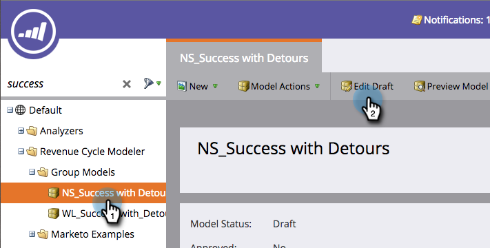

# 變更階段的名稱 {#changing-the-name-of-a-stage}

要改變主意嗎？ 沒問題。 重新命名收入週期Modeler中的階段很容易。

1. 前往「**[!UICONTROL Analytics]**」區域。

   

1. 選取要更新的收入週期Modeler。 按一下「**[!UICONTROL Edit Draft]**」。

   

1. 選取您要更新的階段，並輸入新的&#x200B;**[!UICONTROL Name]**。

   

1. 按一下「**[!UICONTROL Close]**」。

   

   看到沒？ 輕鬆！ 記得要[核准您的模型](/help/marketo/product-docs/reporting/revenue-cycle-analytics/revenue-cycle-models/approve-unapprove-a-revenue-model.md)。
