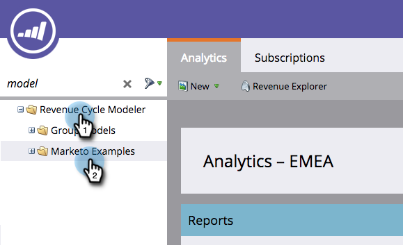
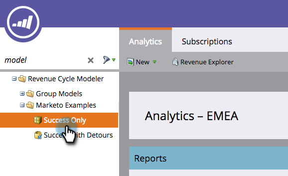

# 原地複製 Marketo 範例收入模型 {#cloning-a-marketo-example-revenue-model}

Marketo提供範例收入模型協助您獲得靈感。 原地複製這些模型化工具，並將其打造為您自己的模型。 方法如下：

1. 前往「**[!UICONTROL Analytics]**」區域。

   

1. 選取&#x200B;**[!UICONTROL Revenue Cycle Modeler]**&#x200B;資料夾，然後按一下&#x200B;**[!UICONTROL Marketo Examples]**。

   

1. 選擇其中一個模型工具。

   

1. 從[!UICONTROL Model Actions]中，選取&#x200B;**[!UICONTROL Clone Model]**。

   

1. 輸入&#x200B;**[!UICONTROL Name]**&#x200B;並按一下&#x200B;**[!UICONTROL Clone]**。

   

   要是能輕鬆創造收入就好了！
