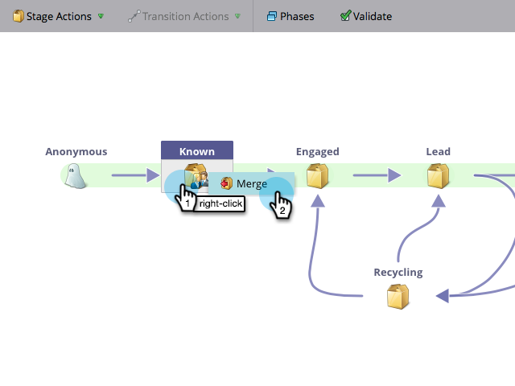

# 合併收入建模器{#merging-two-stages-in-the-revenue-modeler}中的兩個階段

批准模型後，在編輯草稿時不能刪除階段。 您可以將該舞台與另一個舞台合併。

1. 按一下「**行銷人員首頁**」，然後選取「**分析**」。

   

1. 按一下您核准的模型。

   

1. 按一下「編輯草稿」。****

   

1. 按一下右鍵要合併的舞台，然後在菜單中選擇&#x200B;**合併舞台**。

   

1. 在下拉式清單中按一下特定階段。

   

1. 通過在&#x200B;**「模型操作」(Model Actions)**&#x200B;菜單中選擇「批准模型草稿」(Approve Model Draft)**，可以重新批准模型。**

   

>[!NOTE]
>
>在「合併階段」下拉式清單中選擇&#x200B;**無**&#x200B;以從模型中刪除銷售線索
