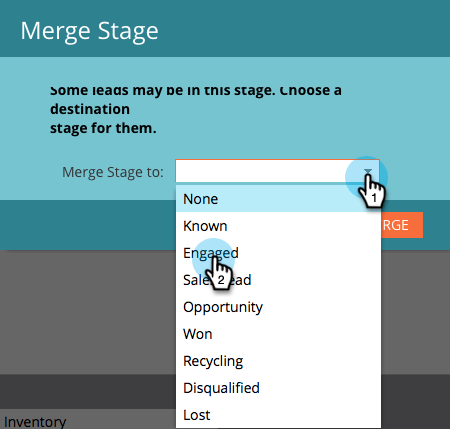

# 合併收入建模器中的兩個階段 {#merging-two-stages-in-the-revenue-modeler}

批准模型後，在編輯草稿時不能刪除階段。 您可以合併該階段與另一個階段。

1. 按一下 **Marketo首頁** 選取 **Analytics**.

   

1. 按一下您核准的模型。

   

1. 按一下 **編輯草稿。**

   

1. 按一下右鍵要合併的舞台並選擇 **合併階段** 的下界。

   

1. 在下拉式清單中按一下特定階段。

   

1. 您可以透過選取 **批准模型草稿** 在 **模型動作** 功能表。

   

>[!NOTE]
>
>挑選 **無** 在「合併階段」(Merge Stage)下拉清單中，從模型中刪除銷售線索
