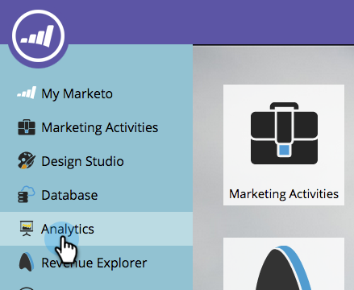

# 報告您的收入模型 {#report-on-your-revenue-model}

對於每個收入週期模型，您可以生成一個報告，說明每個階段有多少個銷售機會。

>[!NOTE]
>
>銷售機會必須是要包含在報告中的模型的成員。

1. 前往 **Analytics**.

   

1. 按一下 **按收入階段列出的銷售機會**.

   

1. 按一下 **設定** 頁簽，然後按兩下篩選器部分下 **收入週期模型**.

   

1. 選取已核准 **模型**.

   

   >[!NOTE]
   >
   >若要從此下拉式功能表使用，模型必須經過核准，或至少具有已核准的階段。

1. 按一下 **報表** 頁簽，查看收入週期模型的每個階段中有多少個銷售機會。

   

為什麼這樣有用？ 模型會顯示您的銷售和行銷漏斗。 在瓶頸成為問題之前，跟蹤其平衡。
