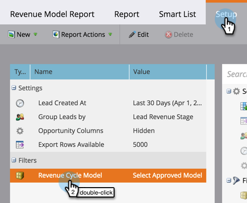

# 收入模型報表 {#report-on-your-revenue-model}

對於每個收入週期模型，您可以產生每個階段中潛在客戶數量的報告。

>[!NOTE]
>
>潛在客戶必須是模型的成員，才能納入報告中。

1. 前往 **Analytics**.

   

1. 按一下 **依收入階段的銷售機會**.

   

1. 按一下 **設定** 標籤，然後在篩選區段底下按兩下 **收入週期模型**.

   

1. 選取已核准的 **模型**.

   

   >[!NOTE]
   >
   >若要從此下拉式功能表使用，模型必須已核准，或至少具有已核准階段。

1. 按一下 **報告** 標籤檢視您的收入週期模型每個階段有多少銷售機會。

   

這為何有用？ 模型會顯示您的銷售和行銷漏斗。 隨時追蹤其餘額，在瓶頸成為問題之前加以識別。
