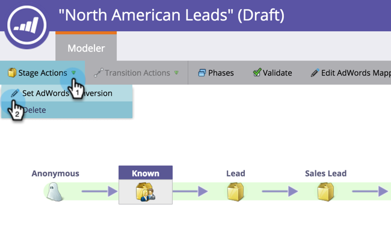

# 在收入模型中使用Manager帳戶{#set-google-adwords-conversions-in-the-revenue-model-with-a-manager-account}設定Google AdWords轉換

將您的Google AdWords帳戶連結至Marketo，以自動將離線轉換資料從Marketo上傳至Google AdWords。 然後，在AdWords中新增自訂欄[後，您就可以從AdWords UI輕鬆看出哪些點按產生了合格的潛在客戶、機會和新客戶（或您想要追蹤的任何收入階段）。](https://support.google.com/adwords/answer/3073556)

如果您有多個Google Adwords帳戶，您可以使用[Google AdWords管理員帳戶](https://www.google.com/adwords/manager-accounts/)（先前稱為My Client Center），將其與Marketo整合。

您可以將AdWords離線轉換對應至「收入」模型中的一或多個階段。 有兩種方式：

* 舞台動作
* AdWords對應

>[!PREREQUISITES]
>
>[將Google AdWords新增為Launchpoint服務及Manager帳戶](/help/marketo/product-docs/administration/additional-integrations/add-google-adwords-as-a-launchpoint-service-with-a-manager-account.md)

## 使用階段操作{#use-stage-action}

在「舞台動作」下映射AdWords轉換。

1. 選取您要對應至AdWords轉換的步驟。

   

1. 在&#x200B;**Stage Actions**&#x200B;下拉式清單下，選擇&#x200B;**Set AdWords Conversion**。

   

1. 設定&#x200B;**AdWords轉換**。

   >[!NOTE]
   >
   >可針對每個子帳戶選取不同的AdWords轉換。

   

   提示：如果您沒有任何AdWords轉換，請按一下&#x200B;**+新轉換**&#x200B;建立。

   

1. 按一下&#x200B;**保存**。

   

1. 將所有AdWords轉換對應至收入階段後，請返回摘要頁面。 選擇&#x200B;**模型操作**&#x200B;並選擇&#x200B;**批准階段**。

   

## 專業提示：新增轉換{#pro-tip-add-a-new-conversion}

專業提示！ 您可從Marketo建立新的AdWords離線轉換。

>[!CAUTION]
>
>從Market建立的新轉換，啟用「最佳化」設定。 這表示AdWords競標策略可讓您最佳化這些轉換的競標。 您可以從AdWords帳戶變更此設定。

1. 在&#x200B;**Stage Actions**&#x200B;下拉式清單下，選擇&#x200B;**Set AdWords Conversion**。

   

1. 選擇&#x200B;**新建轉換**。

   

1. 輸入&#x200B;**轉換名稱**。 按一下&#x200B;**保存**。

   

   太棒了！ 此新轉換將會出現在您的AdWords帳戶中。

## 使用AdWords對應{#use-adwords-mapping}

您可以使用「AdWords對應」，將所有模型階段與AdWords轉換在同一個位置建立關聯。

1. 選擇&#x200B;**編輯AdWords映射**。

   

1. 針對您要追蹤的每個階段，選取所需的&#x200B;**AdWords帳戶**&#x200B;和所需的&#x200B;**AdWords轉換**。

   

1. 映射階段後，按一下&#x200B;**保存**。

   

1. 將所有AdWords轉換對應至收入階段後，請返回摘要頁面。 選擇&#x200B;**模型操作**&#x200B;並選擇&#x200B;**批准階段**。

   

若要檢視離線轉換資料，您必須登入您的AdWords帳戶。 我們建議您使用其[自訂欄功能](https://support.google.com/adwords/answer/3073556)，為您從Marketo匯入的每個離線轉換建立轉換計數欄。
