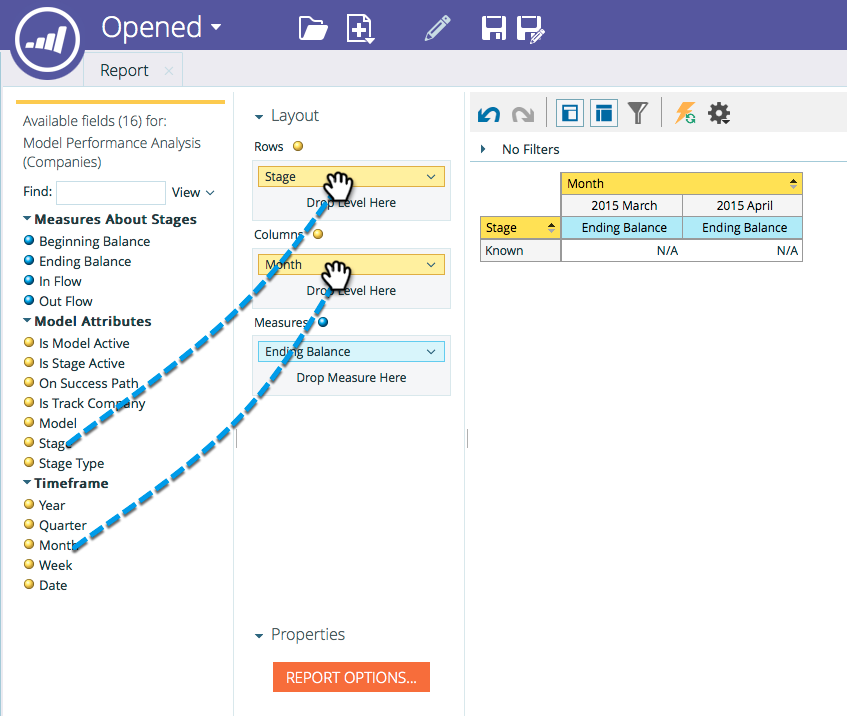

# 收入建立工具{#start-tracking-by-account-in-the-revenue-modeler}中的「開始依帳戶追蹤」

透過「收入階段建立工具」和「收入總管」，您可以深入瞭解銷售機會和帳戶在模型中進行時的效能。

>[!NOTE]
>
>請確定您核准的模型在成功路徑上有階段，並勾選「依帳戶開始追蹤」****

1. 在經過足夠的時間收集有用的資料後，請在&#x200B;**My Marketo Home**&#x200B;下選擇&#x200B;**Revenue Explorer**。

   

1. 要建立新報告，請按一下&#x200B;**檔案**&#x200B;並選擇&#x200B;**新建**，然後選擇&#x200B;**報告**。

   

1. 選擇&#x200B;**Model Performance Analysis(Companies)**&#x200B;作為分析區域，然後按一下&#x200B;**OK**。

   

1. 建議您拖曳&#x200B;**Stage**、**Month**&#x200B;和&#x200B;**Ending Balance**&#x200B;欄位，以依月顯示公司在模型中的發展。 使用篩選器來選擇您想要的月份。

   

1. 完成報告設定後，按一下右鍵&#x200B;**是跟蹤公司**&#x200B;並選擇&#x200B;**過濾器**。 我們將使用此功能將報表限制為僅選取&#x200B;**依帳戶追蹤**&#x200B;的階段。

   

1. 在出現的對話方塊中，選取「是」，然後按一下中間的向右箭頭。 這只會篩選啟用「依帳戶追蹤」的階段。 完成時，按一下&#x200B;**確定**。

   

1. 您的報表現在應只顯示您依帳戶追蹤的階段。 請務必儲存報表，以便日後使用。 現在，您可以將此作為行銷成效的另一個衡量標準。
