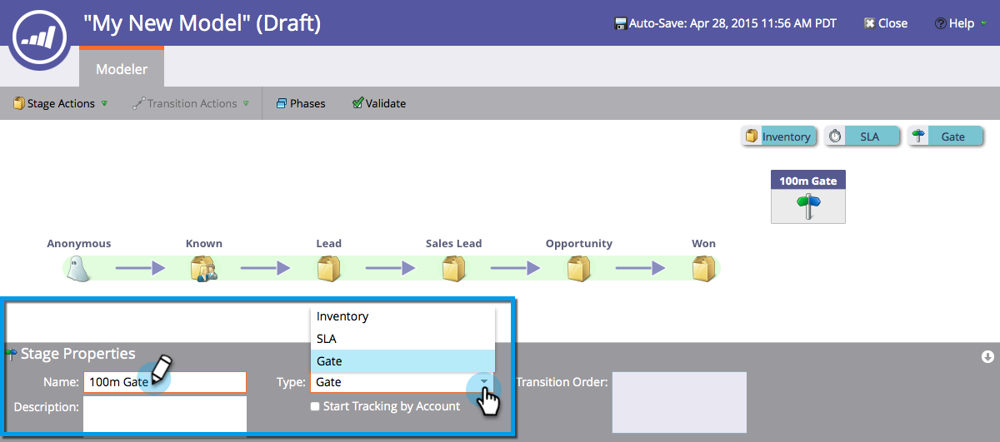

# 使用收入模型入口階段 {#using-revenue-model-gate-stages}

登門階段是資格檢查。

>[!TIP]
>
>最好在圖形或演示程式中建立實踐模型，並與同事確認。

## 添加門級 {#add-a-gate-stage}

1. 前往 **Analytics** 的上界。

   

1. 選取現有模型，或 [建立新的](/help/marketo/product-docs/reporting/revenue-cycle-analytics/revenue-cycle-models/create-a-new-revenue-model.md).

   

1. 按一下 **編輯草稿**.

   

1. 按一下 **門** 按鈕，然後拖放到畫布中的任何位置。

   

1. 編輯 **名稱** 並選取 **類型**.

   >[!NOTE]
   >
   >選擇 [開始依帳戶追蹤](/help/marketo/product-docs/reporting/revenue-cycle-analytics/revenue-cycle-models/start-tracking-by-account-in-the-revenue-modeler.md) 此時可深入了解帳戶在您的模型中進行時的效能。

   

>[!NOTE]
>
>「門階段」會根據您在轉變規則中輸入的標準來分割銷售機會； **它不會阻礙**. 需要預設轉變，這樣其他轉變未選擇的銷售機會最終會經過預設轉變。

## 編輯門級 {#edit-a-gate-stage}

編輯「名稱」(Name)、「說明」(Description)，並調整「門」(Gate)階段的「類型」(Type)。 您也可以選擇 [開始依帳戶追蹤](/help/marketo/product-docs/reporting/revenue-cycle-analytics/revenue-cycle-models/start-tracking-by-account-in-the-revenue-modeler.md).

1. 按一下 **門** 階段圖示。

   

1. 按一下 **名稱** 和 **說明** 欄位來編輯其內容。

   

1. 選取 **類型** 下拉式清單進行編輯。

   

## 刪除門級 {#delete-a-gate-stage}

1. 通過按一下右鍵「柵級」表徵圖並選擇 **刪除**.

   

1. 您也可以按一下Gate階段，然後在 **階段動作** 下拉式清單，選取 **刪除**.

   

1. 刪除這兩種方法都會要求您確認選擇。 按一下 **刪除**.

   

恭喜！ 現在你了解了門階段的美妙世界。

>[!MORELIKETHIS]
>
>* [使用收入模型庫存階段](/help/marketo/product-docs/reporting/revenue-cycle-analytics/revenue-cycle-models/using-revenue-model-inventory-stages.md)
>* [使用收入模型SLA階段](/help/marketo/product-docs/reporting/revenue-cycle-analytics/revenue-cycle-models/using-revenue-model-sla-stages.md)
>* [建立新的收入模型](/help/marketo/product-docs/reporting/revenue-cycle-analytics/revenue-cycle-models/create-a-new-revenue-model.md).

