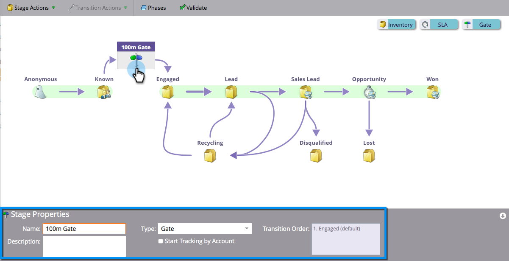

# 使用收入模型閘道階段 {#using-revenue-model-gate-stages}

閘道階段可作為資格檢查。

>[!TIP]
>
>最好在圖形或簡報程式中建立練習模型，並與同事確認。

## 新增閘道階段 {#add-a-gate-stage}

1. 移至&#x200B;**Analytics**&#x200B;區域。

   

1. 選取現有的模型，或[建立新的模型](/help/marketo/product-docs/reporting/revenue-cycle-analytics/revenue-cycle-models/create-a-new-revenue-model.md)。

   

1. 按一下&#x200B;**編輯草稿**。

   

1. 按一下&#x200B;**閘道**&#x200B;按鈕，然後拖放至畫布中的任何位置。

   

1. 編輯&#x200B;**名稱**&#x200B;並選取&#x200B;**型別**。

   >[!NOTE]
   >
   >選取[此時依帳戶開始追蹤](/help/marketo/product-docs/reporting/revenue-cycle-analytics/revenue-cycle-models/start-tracking-by-account-in-the-revenue-modeler.md)，以深入瞭解帳戶在模型中的執行效能。

   

>[!NOTE]
>
>「閘道階段」會根據您在轉換規則中輸入的條件來分割銷售機會；**它不會保留銷售機會**。 需要預設轉變，以便其他轉變未選擇的潛在客戶最終通過預設。

## 編輯閘道階段 {#edit-a-gate-stage}

編輯「名稱」、「說明」，並調整「閘道」階段的「型別」。 您也可以選擇依帳戶[&#128279;](/help/marketo/product-docs/reporting/revenue-cycle-analytics/revenue-cycle-models/start-tracking-by-account-in-the-revenue-modeler.md)開始追蹤。

1. 按一下&#x200B;**閘道**&#x200B;階段圖示。

   

1. 在&#x200B;**名稱**&#x200B;和&#x200B;**描述**&#x200B;欄位中按一下以編輯其內容。

   

1. 選取要編輯的&#x200B;**型別**&#x200B;下拉式清單。

   

## 刪除閘道階段 {#delete-a-gate-stage}

1. 您可以用滑鼠右鍵按一下閘道階段圖示並選取&#x200B;**刪除**，以刪除「閘道階段」。

   

1. 您也可以按一下Gate階段來刪除它，然後在&#x200B;**階段動作**&#x200B;下拉式清單中，選取&#x200B;**刪除**。

   

1. 兩種刪除方法都會要求您確認選擇。 按一下&#x200B;**刪除**。

   

恭喜！ 現在您已瞭解閘道舞台這美好的世界。

>[!MORELIKETHIS]
>
>* [使用收入模型詳細目錄階段](/help/marketo/product-docs/reporting/revenue-cycle-analytics/revenue-cycle-models/using-revenue-model-inventory-stages.md)
>* [使用收入模型SLA階段](/help/marketo/product-docs/reporting/revenue-cycle-analytics/revenue-cycle-models/using-revenue-model-sla-stages.md)
>* [建立新的收入模型](/help/marketo/product-docs/reporting/revenue-cycle-analytics/revenue-cycle-models/create-a-new-revenue-model.md)。
