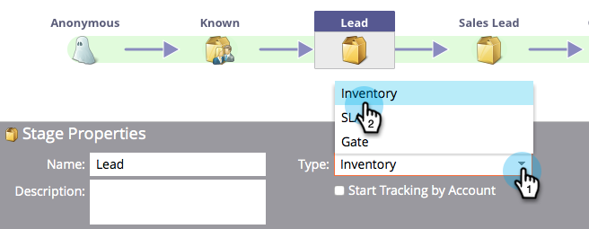

# 使用收入模型庫存階段{#using-revenue-model-inventory-stages}

所有已知銷售線索和帳戶最初駐留在庫存階段。 在這個潛在客源庫中，銷售線索一直得到培育，直到銷售就緒。 庫存階段沒有時間限制。

>[!TIP]
>
>您最好在圖形或簡報程式中建立練習模型，並先與同事確認。

## 添加庫存階段{#add-an-inventory-stage}

1. 若要新增「收入週期模型庫存」階段，請按一下&#x200B;**My Marketo**&#x200B;首頁畫面中的&#x200B;**Analytics**&#x200B;按鈕。

   

1. 在&#x200B;**Analytics**&#x200B;區段中，選取您現有的模型，或[建立新的模型](/help/marketo/product-docs/reporting/revenue-cycle-analytics/revenue-cycle-models/create-a-new-revenue-model.md)。

   

1. 按一下「編輯草稿&#x200B;**」。**

   

1. 若要新增庫存階段，請按一下&#x200B;**庫存**&#x200B;按鈕，然後拖曳並釋放至畫布中的任何位置。

   

1. 您可以自由編輯「名稱」、新增「說明」，並在新增舞台後調整「類型」。 您目前也可以選取「依帳戶開始追蹤」**[。](/help/marketo/product-docs/reporting/revenue-cycle-analytics/revenue-cycle-models/start-tracking-by-account-in-the-revenue-modeler.md)**

   

## 編輯庫存階段{#edit-an-inventory-stage}

當您選擇「庫存」圖示時，可以編輯&#x200B;**名稱**、添加&#x200B;**說明**&#x200B;或調整&#x200B;**類型**。 您也可以選擇[「開始依帳戶追蹤」](/help/marketo/product-docs/reporting/revenue-cycle-analytics/revenue-cycle-models/start-tracking-by-account-in-the-revenue-modeler.md)。

1. 按一下「庫存」圖示。

   

1. 在&#x200B;**名稱**&#x200B;和&#x200B;**說明**&#x200B;欄位中按一下，以編輯其內容。

   

1. 選擇&#x200B;**Type**&#x200B;下拉式清單進行編輯。

   

## 刪除庫存階段{#delete-an-inventory-stage}

1. 您可以通過按一下右鍵或控制按一下清單階段表徵圖來刪除庫存階段。

   

1. 您也可以按一下舞台來刪除舞台，然後在&#x200B;**舞台動作**&#x200B;下拉式清單中，選取&#x200B;**刪除**。

   

1. 這兩種刪除方法都會要求您確認選擇。 按一下&#x200B;**Delete**。

   

恭喜！ 現在，您瞭解庫存階段的美好世界。
