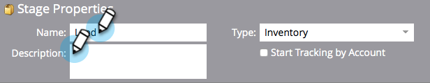

# 使用收入模型庫存階段 {#using-revenue-model-inventory-stages}

所有已知的潛在客戶與帳戶最初都在「存貨階段」中。 此潛在客戶集區是培養潛在客戶直至銷售就緒的場所。 詳細目錄階段沒有時間限制。

>[!TIP]
>
>最好在圖形或簡報程式中建立練習模型，並先與同事確認。

## 新增詳細目錄階段 {#add-an-inventory-stage}

1. 若要新增新的收入週期模型詳細目錄階段，請按一下&#x200B;**[!UICONTROL Analytics]**&#x200B;首頁畫面中的&#x200B;**[!UICONTROL My Marketo]**&#x200B;按鈕。

   

1. 在&#x200B;**[!UICONTROL Analytics]**&#x200B;區段中，選取您現有的模型，或[建立新的模型](/help/marketo/product-docs/reporting/revenue-cycle-analytics/revenue-cycle-models/create-a-new-revenue-model.md)。

   

1. 按一下「**[!UICONTROL Edit Draft]**」。

   

1. 若要新增詳細目錄階段，請按一下&#x200B;**[!UICONTROL Inventory]**&#x200B;按鈕，然後拖曳並發行到畫布內的任何位置。

   

1. 您可以編輯&#x200B;**[!UICONTROL Name]**、新增&#x200B;**[!UICONTROL Description]**&#x200B;並在新增階段後調整&#x200B;**[!UICONTROL Type]**。 您現在也可以選取&#x200B;**[[!UICONTROL Start Tracking by Account]](/help/marketo/product-docs/reporting/revenue-cycle-analytics/revenue-cycle-models/start-tracking-by-account-in-the-revenue-modeler.md)**。

   

## 編輯詳細目錄階段 {#edit-an-inventory-stage}

當您選取詳細目錄圖示時，可以編輯&#x200B;**[!UICONTROL Name]**、新增&#x200B;**[!UICONTROL Description]**&#x200B;或調整&#x200B;**[!UICONTROL Type]**。 您也可以選取[[!UICONTROL Start Tracking by Account]](/help/marketo/product-docs/reporting/revenue-cycle-analytics/revenue-cycle-models/start-tracking-by-account-in-the-revenue-modeler.md)。

1. 按一下&#x200B;**[!UICONTROL Inventory]**&#x200B;圖示。

   

1. 按一下&#x200B;**[!UICONTROL Name]**&#x200B;和&#x200B;**[!UICONTROL Description]**&#x200B;欄位以編輯其內容。

   

1. 選取要編輯的&#x200B;**[!UICONTROL Type]**&#x200B;下拉式清單。

   

## 刪除詳細目錄階段 {#delete-an-inventory-stage}

1. 您可以按一下右鍵或按住Control鍵並按一下詳細目錄階段圖示，以刪除「詳細目錄階段」。

   

1. 您也可以按一下某個階段來刪除它，然後在&#x200B;**[!UICONTROL Stage Actions]**&#x200B;下拉式清單中選取&#x200B;**[!UICONTROL Delete]**。

   

1. 兩種刪除方法都會要求您確認選擇。 按一下「**[!UICONTROL Delete]**」。

   

恭喜！ 現在您已瞭解詳細目錄階段的美妙世界。
