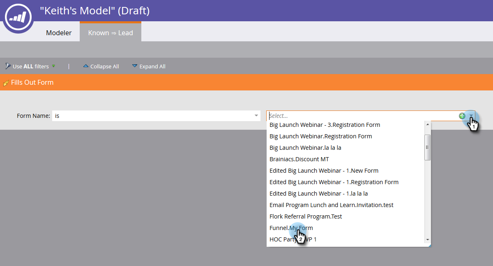
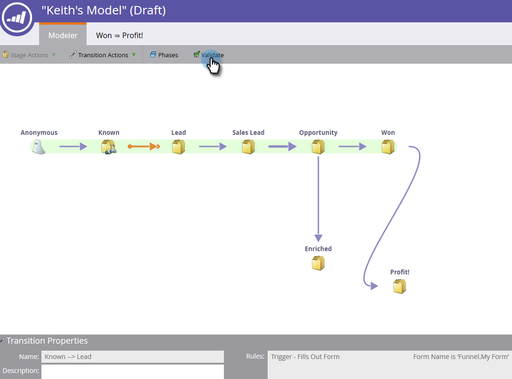

# 使用收入模型轉變 {#using-revenue-model-transitions}

>[!PREREQUISITES]
>
>[建立新的收入模型](/help/marketo/product-docs/reporting/revenue-cycle-analytics/revenue-cycle-models/create-a-new-revenue-model.md)

當您建立模型並選取及組織存貨階段時，是時候設定轉變了。

1. 以滑鼠右鍵（您也可以按兩下）按一下其中一個箭頭以開始，然後選取 **編輯轉變**.

   

   >[!NOTE]
   >
   >無法編輯「匿名⇒已知」轉變規則。

1. 將會為您選取的轉變開啟一個新標籤。

   

1. 轉換可控制潛在客戶在階段之間的移動方式。 從右邊拖曳您選擇的觸發器（或篩選器），然後隨處將觸發器釋放到畫布上。 在此範例中，我們將選取「填寫表單」觸發器。

   >[!TIP]
   >
   >由於收入模型程式正在為您設定報表，因此建議轉變一律包含觸發器。 如此一來，您的報表就會反映模型/階段流程的真實速度。 可新增篩選器並搭配觸發其他限制。

   

1. 為您選取的觸發器/篩選器選擇引數。

   

1. 若要返回您的模型，請按一下 **模型工具**.

   

1. 現在您會在畫面底部看到轉變規則。

   

1. 設定好所有轉變的規則後，請按一下 **驗證** 以進行驗證。

   

1. 如果操作正確，您將看到以下訊息。

   

做得好！ 您已成功修改模型轉接。

>[!MORELIKETHIS]
>
>[核准/取消核准收入模型](/help/marketo/product-docs/reporting/revenue-cycle-analytics/revenue-cycle-models/approve-unapprove-a-revenue-model.md)
