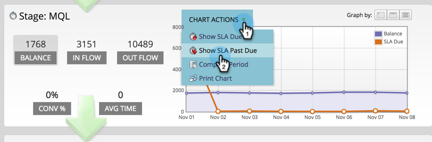

# 使用成功路徑分析器 {#using-the-success-path-analyzer}

使用Success Path Analyzer來探索特定詳細資訊，這些詳細資訊會反映您的各個階段中的人員流量（數量）和速度（速度，以天為單位） [收入週期模型](/help/marketo/product-docs/reporting/revenue-cycle-analytics/revenue-cycle-models/understanding-revenue-models.md).

>[!PREREQUISITES]
>
>[建立成功路徑分析器](/help/marketo/product-docs/reporting/revenue-cycle-analytics/revenue-cycle-models/create-a-success-path-analyzer.md)

1. 前往 **分析** 並選取 **成功路徑分析器**.

   

   右側的圖表反映左側所選按鈕中的資料。 依預設，此為「餘額」。

1. 按一下 **流入量** 以圖形化在選取的時間範圍內有多少人進入舞台。

   

   * 按一下「外流」以圖形化有多少人退出此階段。
   * 按一下「轉換%」，繪製此階段至下一個階段的轉換率圖表。
   * 按一下「平均時間」可檢視使用者在這個階段逗留多久後，才移至下一個階段。

1. 按一下 **圖表動作** >比較期間，將資料與長度相等的不同時間範圍進行比較。

   

1. 選取 **從** 比較期間的日期。

   

   此 **至** 日期會自動設定為符合您原始時段的長度。

1. 按一下 **比較**.

   

1. 圖表會以綠色更新比較期間的重疊資料。

   

1. 若要變更圖表的時間比例，請按一下 **圖表依據** 按鈕：每日（預設）、每週和每月

   

1. 對於具有SLA （服務等級協定）的階段，按一下 **圖表動作** > **顯示SLA截止日期** 顯示在指定時間範圍內遺漏SLA目標的每個人。

   

1. 圖表會更新，以反映每個節點到期的SLA數量（橘色）。

   

   顯示為橘色的人可能會 *也可能不會* 仍然處於SLA階段。

1. 按一下 **圖表動作** > **顯示SLA過期** 顯示所有具有過期的SLA目標且在指定時段結束時仍處於SLA階段的人員。

   

1. 圖表會更新，以反映每個節點上逾期的SLA數量（橘色）。

   

1. 若要讀取特定節點（日期）上資料點的特定詳細資料，請將滑鼠指標暫留在泡泡圖上。

   

1. 若要列印圖表，請按一下 **圖表動作** > **列印圖表**.

   

分析器可協助您瞭解模型中的移動情形。 隨著您不斷取得進步，這對於您策略化行銷工作將變得非常重要。
