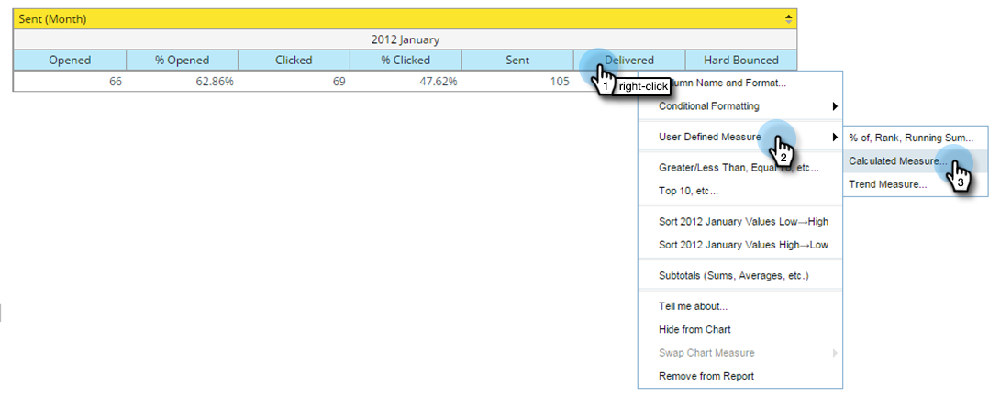

# 新增自訂計量至Revenue Explorer報表 {#adding-custom-measures-to-a-revenue-explorer-report}

有時候，您會想要在報表中使用自訂量值。 您可以輕鬆建立自己的網站。

在下列範例中，您會建立軟跳出的計算量度，它會取用報表中已有的量度，並使用基本數學來建立新量度。 您也可以建立其他型別的測量。

>[!PREREQUISITES]
>
>您的報表中至少需要一個量度，但並非您必須使用其中一個量度來定義自訂量值。

1. 提取您報告所需的欄位。 另請參閱 [新增欄位至收入總管報表](/help/marketo/product-docs/reporting/revenue-cycle-analytics/revenue-explorer/adding-fields-to-a-revenue-explorer-report.md) 以取得詳細資訊。

1. 以滑鼠右鍵按一下現有量度（藍色儲存格），然後按一下 **使用者定義的測量** 並選取 **計算的計量**.

   

1. 為自訂量值命名並選取格式。

   

1. 在左側按一下您需要的每個專案，然後按一下箭頭將其移動。 視需要新增數學符號。

   

   >[!TIP]
   >
   >您可以自行鍵入數學符號，或使用選取方塊。

1. 完成後，按一下 **確定**.

   

   您的新自訂量值會在報表中顯示為新欄。

   

   >[!MORELIKETHIS]
   >
   >[新增欄位至收入總管報表](/help/marketo/product-docs/reporting/revenue-cycle-analytics/revenue-explorer/adding-fields-to-a-revenue-explorer-report.md)
